# The North American Regional Carbon Flux Model
 
> #### Creating a more effective model for CO2 flux in North America based on regional variables.
 
Can we create a carbon flux model that uses inverse model estimates of carbon flux to train a neural network? Instead of using scaled-up carbon flux data, we can use inverse model estimates that capture large-scale carbon flux features because they are directly linked to the atmospheric CO2 data. This differs from other models because instead of using site-level data for carbon flux, our model is using region-wide averages to provide a better idea of the activity of carbon flux over broader areas. But unlike site-level estimates, inverse fluxes lack some of the detailed information like the temporal resolution. By also using regional environmental variables, we can make a model for CO2 flux for North America by utilizing the inverse model method to create data-driven carbon flux estimates for a large region. 
 
 
- [The Data](#the-data)
   - [How data was chosen](#how-data-was-chosen)
   - [Refining Data](#refining-data)
   - [Data Plots](#data-plots)
   - [Top-Down vs Bottom-Up](#top-down-vs-bottom-up)
   - [Other Information](#other-information)
- [The Model](#the-model)
   - [Background Information](#background-information)
   - [The Structure](#the-structure)
   - [Development](#development)
   - [Problems](#problems)
- [Evaluating Our Results](#evaluating-our-results)
- [Future Directions](#future-directions)
- [References](#references)
 
 
## The Data
 
### How Data Was Chosen
We chose our datasets based on what features we thought would give us the best indication of carbon flux in North America and what factors contribute to that figure. These include radiation, soil moisture, humidity, precipitation, and then used inverse model estimated carbon flux data to train the model. We also focused on data available over North America at monthly 1x1 degree resolution.

 
### Refining Data

<center>

<div style="width: 70%">

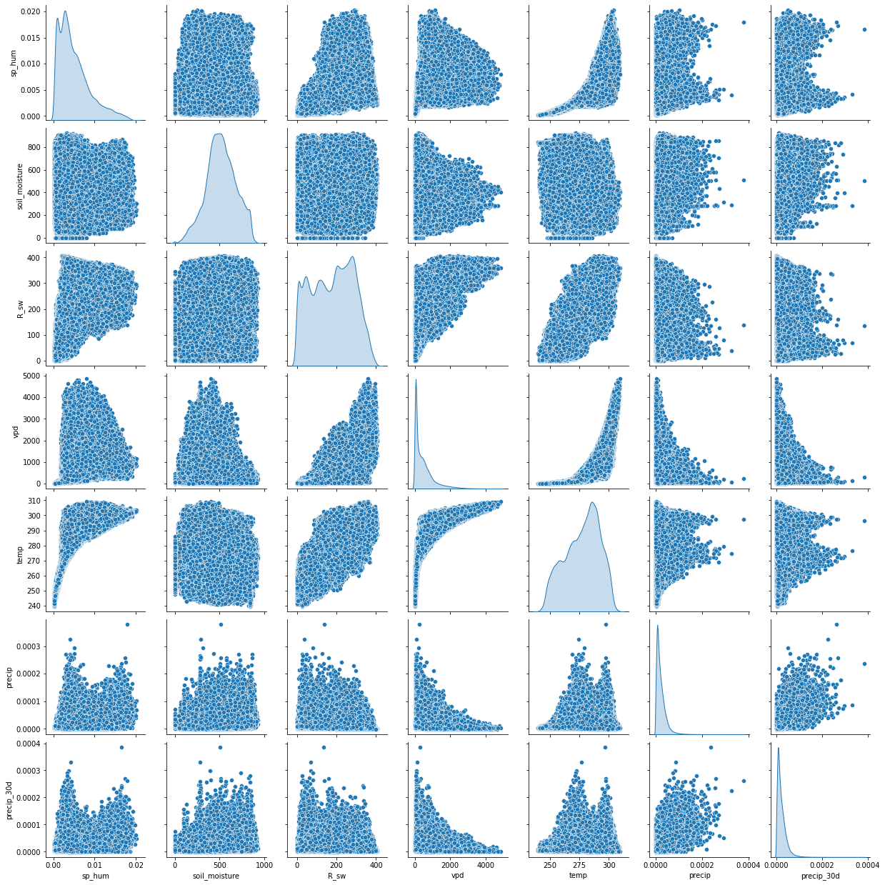
</div>

   <p>
      <em>Figure 1</em>
   </p>
</center>


 
By viewing our data in a pairplot, we saw which variables had similar data which could potentially mistrain the model by introducing redundant information. For example, the precip and the percip30d variables correlated closely with each other on the pairplot however when testing, we found that the removal of this variable did not affect the model in a measurable way. Later, we added R_sw and rel_hum because downwelling radiation is one of the main drivers of photosynthesis and vegetation dynamics. Relative humidity also plays an important role in photosynthesis.
 
### Data Plots
 
<center>

<div style="width: 70%">

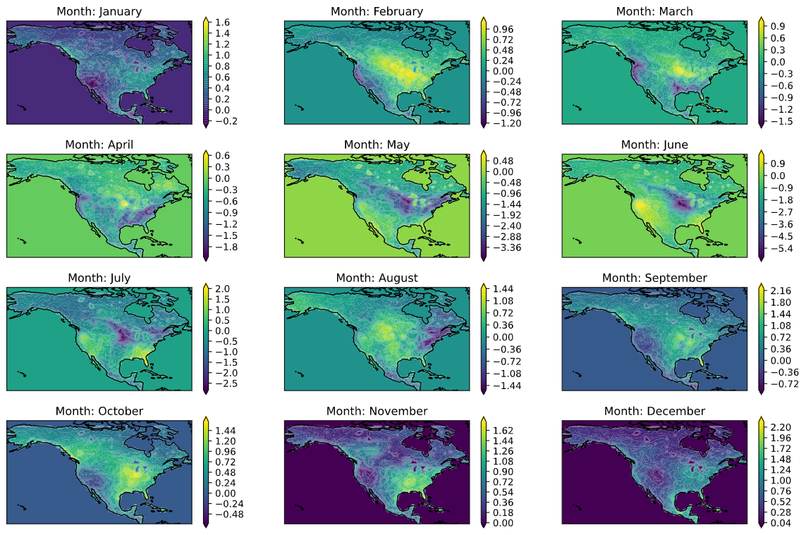
</div>

   <p>
      <em>Figure 2</em>
   </p>
</center>
 
This chart shows us the monthly carbon flux from our target dataset<sup>2</sup> for 2007 in North America and allows us to see patterns in seasonal carbon flux
 
<center>

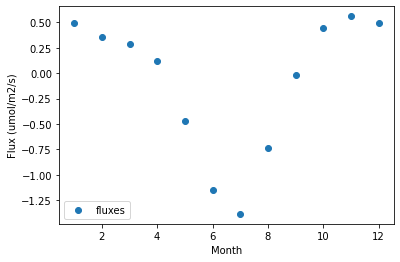

   <p>
      <em>Figure 3</em>
   </p>
</center>
 
This scatter plot shows us the monthly mean of flux values of all years in target data<sup>2</sup> which we will use later to evaluate our model. 
 
### Top-Down vs Bottom-Up
The are two main methods when it comes to the estimation of carbon flux. One is the bottom-up method which is performed by taking carbon flux measurements at a ~1 km^2 scale and then constructing an array of data with the numerous measurements. However, with the problem of model carbon flux for the entirety of North America, this method is ineffective as it relies on extrapolating and scaling relationships up to larger regions which can be problematic. One of the benefits of top-down modeling is that it can provide estimates of the net flux over large areas based on the patterns of atmospheric CO2 observations. A drawback is that because we only have estimates for a large area, we have no information about what sources may be contributing more atmospheric CO2.
### Other Information
For the datasets that we have chosen, the data spans from 2007-2015. For training the model, we will be using the first 6 years of data available and the rest for testing. We also reused our testing set as the validation data for the model. The main reason for creating a model only for North America was mostly because of the availability of training data from the same time period and resolution. 
 
## The Model
### Background Information
To accurately predict carbon flux values for North America, we are using a neural network to estimate carbon fluxes. The features we are using are:  soil moisture, humidity, and precipitation. The target data we are using to train the model are: raw carbon flux values. A neural network is a machine learning process that is modeled as an interconnected network of neurons  to “learn” from training data to then predict outcomes given a set of features. We are using a neural network  to estimate  carbon fluxes because the neural network is  able to  model complex non-linear relationships  which exist in the carbon flux data. 
 
### The Structure
For the structure of our model, we first looked at the WECANN<sup>3</sup> model which asks a similar question but instead estimated gross carbon fluxes(GPP). However, the structure of their model proved to be ineffective in our testing, so we had to use a more complex model. 
 
 
<center>

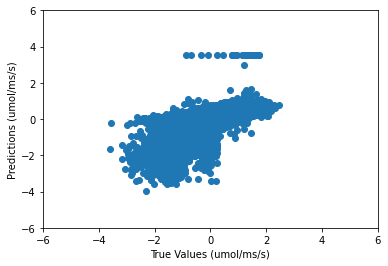

   <p>
      <em>Figure 4</em>
   </p>
</center>
<br/>
Above is a prediction scatter plot from the single-layer model which shows how the simple model was not effective enough to provide useful estimations.<br/><br/>
 
 
### Development
After we decided to use a more complex model, we started by adding another layer and iteratively testing different numbers of neurons for that layer.
 
At about 25 neurons in the hidden layer, we observed improved model performance with the estimations reaching 0.91 correlation value compared to actual values.
 
<center>

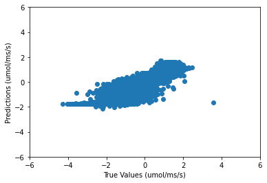


   <p>
      <em>Figure 5</em>
   </p>
</center>
This scatter plot shows the model's estimates versus the true values and, as compared to the previous simple model, estimated carbon flux values effectively. 
 
### Problems
While the model that we showed above does perform well, we realized that the model was performing well mainly because the features we included had too much information and thus the problem was too simple. This is because we included the longitude, latitude, and month and the model relied too heavily on this data for predicting carbon flux rather than using the environmental variables we intended to use. To continue the development of our model, we were forced to remove all spatial and time variables only use the environmental data variables in the model. 
 
At this point, without time and space variables, model performance dropped to below a 0.60 correlation value. We also decided that a much larger model would be needed to improve model performance estimates based on our regional data.
 
To restart model development, we first looked at what the model was actually predicting versus the true values to give us a better idea of what specifically we had to improve.
 

<center>

   <div style="display: flex; flex-direction: row">
   <div style="width: 50%">

   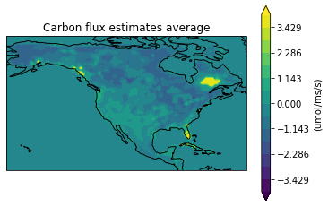
   </div>

   <div style="width: 50%">

   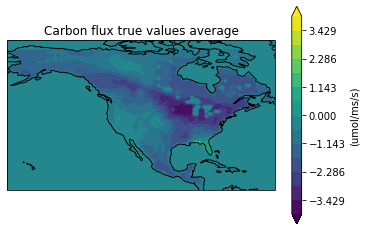
   </div>
   
   </div>


   <p>
      <em>Figure 6</em>
   </p>
</center>

 
We can see the model understands generally which areas show higher and lower carbon flux values, like higher flux values near the west coast of North America, but is severely under compensating on the edges of the flux scale, especially over the North-Eastern United States. This showed us that we needed to focus on two different strategies: create a more complex model and also experiment with longer training.
 
Again, after much experimentation, this is the structure we decided on for our model.
 
```
model = Sequential()
model.add(Dense(50,input_dim=X_full.shape[1], activation='relu'))
model.add(Dense(100,input_dim=X_full.shape[1], activation='relu'))
model.add(Dense(100,input_dim=X_full.shape[1], activation='relu'))
model.add(Dense(100,input_dim=X_full.shape[1], activation='relu'))
model.add(Dense(50,input_dim=X_full.shape[1], activation='relu'))
model.add(Dense(50,input_dim=X_full.shape[1], activation='relu'))
model.add(Dense(1,input_dim=X_full.shape[1], activation='linear'))
```
 
As we added four more hidden layers and scaled up all of the hidden layer nodes, from 20 to 100 neurons for the largest layers, the accuracy of our model greatly increased. 
 

<center>

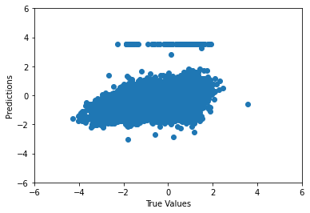

   <p>
      <em>Figure 7</em>
   </p>
</center>
<br>
 
We also made some changes to how we trained our model. Instead of just 20 epochs, we started training our model for 100 epochs. We also used the shuffle option for Keras which changes how data is passed through each epoch and made our validation data the same as our test data which changed how the model evaluated itself when it was training. 
 
 
Now, our correlation value was at about 0.83. After this, we introduced a new feature to the model that provided land cover data in the form of id's for 18 different biomes of North America. An example for one biome is shown below:

<center>

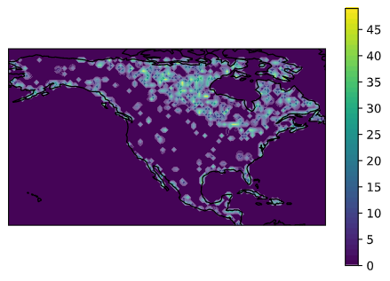

   <p>
      <em>Figure 8</em>
   </p>
</center>


We decided to include this because we thought it might fill some of the gaps where the model was not able to fully predict carbon flux for a specific area. Our correlation value jumped to about 0.90 and the scatter plot for this can be seen below.

<center>

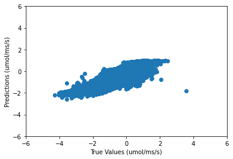

   <p>
      <em>Figure 9</em>
   </p>
</center>
 
### Evaluating Our Results
 
As shown above, our model can accurately estimate carbon flux on a monthly basis and, while still slightly underestimating in some areas, it can still model carbon flux for North America solely based on regional variables. On our scatter plots, we can see that our model still struggles around the summer months as the mean carbon flux for North America increases greatly but is more accurate with other parts of the year. Our monthly carbon flux scatter plot also demonstrates why our model is under underestimating. 


<center>

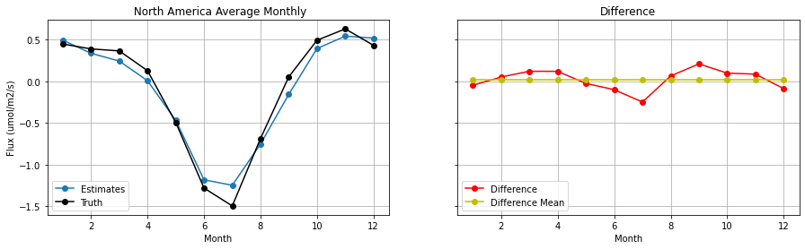

   <p>
      <em>Figure 10</em>
   </p>
</center>


<center>

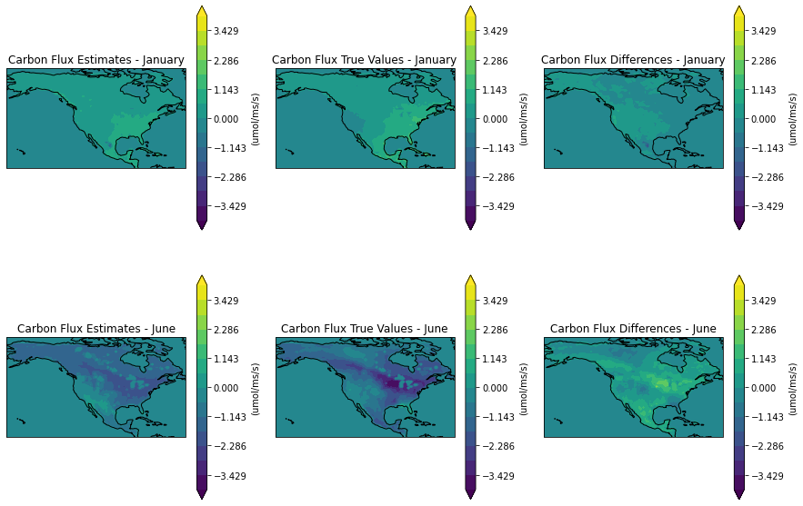

   <p>
      <em>Figure 11</em>
   </p>
</center>

To further evaluate our model, we wanted to compare our results to that of another carbon flux model, but specifically one that used the bottom up method for modeling carbon flux. For this, we chose the Fluxcom model<sup>4</sup>. The figure below demonstrates how our model compares to the Fluxcom model for predicting carbon flux:

<center>

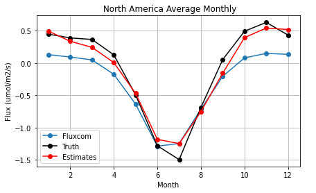

   <p> 
      <em>Figure 12</em>
   </p>
</center>

The Fluxcom model, in blue, actually underestimates carbon flux for the winter months but stays consistant with our model and the true values over summer months, a time with more photosynthesis and carbon flux output occuring in North America. This not only shows the differences between bottom-up and inverse modeling for carbon flux, but also the viability and potential benefits of using the inverse modeling method for other environmental applications. 
 
## Future Directions
After completing the creation of the model, there are a couple of areas that I want to explore that could potentially improve the model or put it to a certain use. One addition I could make is the use of other environmental data like the percent of forest cover in certain areas and how certain biomes compare and affect carbon flux. I would also like to expand my model to a larger region and explore what alteration I might  need to make to adapt it to a part of the world.
 
 
## References
Inverse Modeling
https://iopscience.iop.org/article/10.1088/1748-9326/aad505
   Yoichi P Shiga et al 2018 Environ. Res. Lett. 13 084015
 
NARR Data
https://www.ncdc.noaa.gov/data-access/model-data/model-datasets/north-american-regional-reanalysis-narr
Mesinger, F., G. DiMego, E. Kalnay, K. Mitchell, and Coauthors, 2006: North American Regional Reanalysis. Bulletin of the American Meteorological Society, 87, 343–360, doi:10.1175/BAMS-87-3-343.
 
WECANN Model
https://bg.copernicus.org/articles/14/4101/2017/bg-14-4101-2017-discussion.html
Alemohammad, Hamed & Fang, Bin & Konings, Alexandra & Green, Julia & Kolassa, Jana & Prigent, Catherine & Aires, Filipe & Miralles, Diego & Gentine, Pierre. (2016). Water, Energy, and Carbon with Artificial Neural Networks (WECANN): A statistically-based estimate of global surface turbulent fluxes using solar-induced fluorescence. Biogeosciences Discussions. 1-36. 10.5194/bg-2016-495.
