```python
import tensorflow as tf
import keras
from keras.models import Sequential
from keras.layers import Dense
from keras.utils import np_utils
from keras import regularizers
import numpy as np
from sklearn.metrics import accuracy_score
from sklearn import preprocessing
from sklearn.preprocessing import QuantileTransformer
import os.path
from netCDF4 import Dataset
import matplotlib.pyplot as plt
from cartopy import config
import cartopy.crs as ccrs
import pandas as pd
import seaborn as sns
from sklearn.metrics import r2_score
import scipy.stats
data_dir = "/Users/ashwin/Documents/Github/polygence/Monthly/"

monthsArr=['January', 'February', 'March', 'April', 'May', 'June', 'July', 'August', 'September', 'October', 'November', 'December']
```


```python
filename_flux = data_dir + "flux_training/geoinv-sif-monthly-2007-to-2015.nc"
nc_inv = Dataset(filename_flux, 'r')  # open inversion file using netcdf reader
print(nc_inv)
flux_var = np.array(nc_inv.variables['monthly_flux']) # create numpy array note shape of flux is [ time dimension x space dimension]

num_rows, num_cols = flux_var.shape # number of rows and columns

flux_var=flux_var.reshape((num_rows*num_cols, 1),) # reshape into one vector by stacking each column (month)

# double check shape/reshape order

# plot monthly average
print(flux_var.shape)

# reshape to average by month
b = np.reshape(np.ravel(flux_var, order='F'), (2613,12,9,-1),order='F')
# average by year
b = np.mean(b,axis=0)

print(b.shape)
# average by month
b = np.mean(b,axis=1)

# print(X_full_av_mon.shape)

# month variable
mon_array = np.arange(1, 13, dtype=float)

# plot monthly averages averaged over all North America
plt.scatter(mon_array,b,label="fluxes")
plt.legend(loc="lower left")

plt.xlabel('Month')
plt.ylabel('Flux (umol/m2/s)')
plt.show()
```

    <class 'netCDF4._netCDF4.Dataset'>
    root group (NETCDF4 data model, file format HDF5):
        dimensions(sizes): x(2613), time(108)
        variables(dimensions): int64 x(x), int64 time(time), float64 monthly_flux(time, x), float64 se_monthly_flux(time, x)
        groups: 
    (282204, 1)
    (12, 9, 1)


    
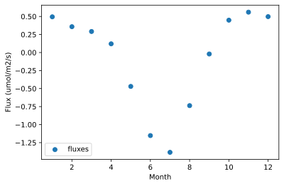
    


```python
# load lat lon variables and create month variable
filename_narr = data_dir + "predictors/narr-2007-NA-monthly.nc"
nc_narr = Dataset(filename_narr, 'r')  # open data file using netcdf reader
lat_var = np.array(nc_narr.variables["lat"]) # create numpy array note shape of lat vars is [space dimension ]
lon_var = np.array(nc_narr.variables["lon"]) # create numpy array note shape of lat vars is [space dimension ]

# tile to correct dimensions
lat_var_all=np.tile(lat_var,(1,12*9))
lon_var_all=np.tile(lon_var,(1,12*9))

# creat lat and lon variables
lat_var_all=np.transpose(lat_var_all)
lon_var_all=np.transpose(lon_var_all)

print(lon_var_all.shape)
print(lat_var_all.shape)

# create month variable
month_vec=[]
for months in range(1, 13):
    a=np.empty(2613);
    a.fill(months)
    month_vec.extend(a)

month_vec=np.tile(month_vec,(1,9))
month_vec=np.transpose(month_vec)
print(month_vec.shape)


# double check shape/reshape order

# plot monthly average
print(flux_var.shape)

# reshape to average by month
b = np.reshape(np.ravel(month_vec, order='F'), (2613,12,9,-1),order='F')
# average by year
b = np.mean(b,axis=0)

print(b.shape)
# average by month
b = np.mean(b,axis=1)

# print(X_full_av_mon.shape)

# month variable
mon_array = np.arange(1, 13, dtype=float)
```

    (282204, 1)
    (282204, 1)
    (282204, 1)
    (282204, 1)
    (12, 9, 1)


```python
filename_modis = data_dir + "predictors/modis-2007-to-2016-NA-monthly.nc"
nc_modis = Dataset(filename_modis, 'r')  # open data file using netcdf reader
nirv_var = np.array(nc_modis.variables["NIRv"]) # create numpy array note shape of narr vars is [space dimension x time dimension]
num_rows, num_cols = nirv_var.shape # number of rows and columns\

nirv_var=nirv_var.reshape((num_rows*num_cols, 1),order='F') # reshape into one vector by stacking each column (month)
nirv_var=nirv_var[0:2613*9*12]
nirv_var[np.isnan(nirv_var)] = 0
print(nirv_var.shape)

ndvi_var = np.array(nc_modis.variables["NDVI"])
ndvi_var=ndvi_var.reshape((num_rows*num_cols, 1))
ndvi_var=ndvi_var[0:2613*9*12]
ndvi_var[np.isnan(ndvi_var)] = 0
print(ndvi_var.shape)

```

    (282204, 1)
    (282204, 1)


```python
# filename for sif data
filename_sif = data_dir + "predictors/sif-2007-to-2016-NA-monthly.nc"
nc_sif = Dataset(filename_sif, 'r')

sif_varR = np.array(nc_sif.variables["RSIF::SIF"]) # create numpy array note shape of narr vars is [space dimension x time dimension]
num_rows, num_cols = sif_varR.shape # number of rows and columns
sif_varR=sif_varR.reshape((num_rows*num_cols, 1),order='F') # reshape into one vector by stacking each column (month)
sif_varR=sif_varR[0:2613*9*12]
sif_varR[np.isnan(sif_varR)] = 0
print(sif_varR.shape)

sif_var2A = np.array(nc_sif.variables["GOME2A::SIF"]) # create numpy array note shape of narr vars is [space dimension x time dimension]
num_rows, num_cols = sif_var2A.shape # number of rows and columns
sif_var2A=sif_var2A.reshape((num_rows*num_cols, 1),order='F') # reshape into one vector by stacking each column (month)
sif_var2A=sif_var2A[0:2613*9*12]
sif_var2A[np.isnan(sif_var2A)] = 0
print(sif_var2A.shape)

sif_var2B = np.array(nc_sif.variables["GOME2B::SIF"]) # create numpy array note shape of narr vars is [space dimension x time dimension]
num_rows, num_cols = sif_var2B.shape # number of rows and columns
sif_var2B=sif_var2B.reshape((num_rows*num_cols, 1),order='F') # reshape into one vector by stacking each column (month)
sif_var2B=sif_var2B[0:2613*9*12]
sif_var2B[np.isnan(sif_var2B)] = 0
print(sif_var2B.shape)

sif_var_oco2 = np.array(nc_sif.variables["OCO2::SIF"]) # create numpy array note shape of narr vars is [space dimension x time dimension]
num_rows, num_cols = sif_var_oco2.shape # number of rows and columns
sif_var_oco2=sif_var_oco2.reshape((num_rows*num_cols, 1),order='F') # reshape into one vector by stacking each column (month)
sif_var_oco2=sif_var_oco2[0:2613*9*12]
sif_var_oco2[np.isnan(sif_var_oco2)] = 0
print(sif_var_oco2.shape)
```

    (282204, 1)
    (282204, 1)
    (282204, 1)
    (282204, 1)


```python
b = np.reshape(np.ravel(sif_varR, order='F'), (2613,12,9,-1),order='F')
a = np.reshape(np.ravel(nirv_var,order='F'), (2613,12,9,-1),order='F')
c = np.reshape(np.ravel(ndvi_var,order='F'), (2613,12,9,-1),order='F')

# average by year
b = np.mean(b,axis=0)
a = np.mean(a,axis=0)
c = np.mean(c,axis=0)

print(b.shape)
# average by month
#b = np.mean(b,axis=1)
b = b.reshape(1,12*9,order='F')

#a = np.mean(a,axis=1)
a = a.reshape(1,12*9,order='F')
# print(X_full_av_mon.shape)
c = c.reshape(12*9,1,order='F')

# month variable
mon_array = np.arange(0, 12*9, dtype=float)
time_array = np.arange(0, 120, dtype=float)

# plot monthly averages averaged over all North America
# plt.scatter(mon_array,a,label="NIRv")
plt.scatter(mon_array,b,label="SIF")
# plt.scatter(mon_array,c,label="NDVI")
# plt.scatter(time_array,time_var,label="time var")

plt.legend(loc="lower left")
plt.ylabel('SIF')
# plt.ylabel('NDVI')

#plt.ylabel('NIRv')
plt.xlabel('Month')
plt.show()
```

    (12, 9, 1)


    
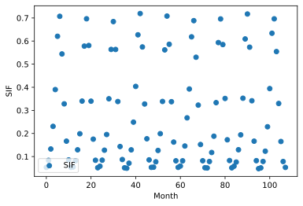
    


```python
var_names = ['sp_hum','precip','soil_moisture','R_sw','vpd','temp','precip_30d']

final = []
# loop over variable names
for i in range(0, len(var_names)):
    final.append([])
    for number in range(2007, 2016):
        #print(number)
        filename_narr = data_dir + "predictors/narr-%d-NA-monthly.nc" % number
        nc_narr = Dataset(filename_narr, 'r')
        #print(i)
        narr_var = np.array(nc_narr.variables["{}".format(var_names[i])])
        num_rows, num_cols = narr_var.shape
        final[i].extend(narr_var.reshape((num_rows*num_cols, 1),order='F'))

# print(len(final))
# print(len(final[0]))
# print(len(final[0][0]))
X2 = np.array(final) # create numpy array from list

# print(X.shape)
X2 = np.transpose(np.squeeze(X2)) # transpose and remove singular dimension (squeeze)
print(X2.shape)


# double check shape/reshape order

# plot monthly average
print(flux_var.shape)

# reshape to average by month
b = np.reshape(np.ravel(X2[:,3], order='F'), (2613,12,9,-1),order='F')
# average by year
b = np.mean(b,axis=0)

print(b.shape)
# average by month
b = np.mean(b,axis=1)

# print(X_full_av_mon.shape)

# month variable
mon_array = np.arange(1, 13, dtype=float)

# plot monthly averages averaged over all North America
plt.scatter(mon_array,b,label="Radiation")
plt.legend(loc="lower left")

plt.xlabel('Radiation')
plt.ylabel('Month')
plt.show()
```

    (282204, 7)
    (282204, 1)
    (12, 9, 1)


    
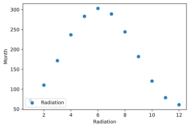
    


```python
def data2grid(lats,lons,data):
    # create grid of lat lon (expand lat by 5 degrees)
    xi = np.arange(lons.min(), lons.max()+1,1)
    yi = np.arange(lats.min(), lats.max()+5,1)
    xi, yi = np.meshgrid(xi, yi)
    zi = np.zeros(yi.shape) # place holder for flux variable

    # loop over values, find index of lat & lon, enter flux variable
    for i in range(len(data)):
        min_temp_lat=abs(lats[i]-yi[:,0])
        min_temp_lon=abs(lons[i]-xi[0,:])
        lat_ind = (min_temp_lat == min(min_temp_lat))
        lon_ind = (min_temp_lon == min(min_temp_lon))
        zi[lat_ind,lon_ind]=data[i]
    return xi, yi, zi
```


```python
# plotting example

# plot flux data
flux = nc_inv.variables['monthly_flux'][0, :] # note shape of flux is [space dimension x time dimension]

# save lat lon from **MODIS** variable ****<<<<<IMPORTANT>>>>>******
lats = nc_modis.variables['lat'][:]
lons = nc_modis.variables['lon'][:]

xi, yi, zi_flux = data2grid(lats,lons,flux) # regrid for plotting

# projection axis
ax = plt.axes(projection=ccrs.PlateCarree())

# plot contour of variable using gridded  lat, lon, and variable
plt.contourf(xi, yi, zi_flux, 60,
             transform=ccrs.PlateCarree())
# add coasts
ax.coastlines()


plt.colorbar()
plt.show()

```


    
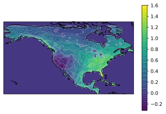
    


```python
fig, ((ax1, ax2, ax3), 
      (ax4, ax5, ax6), 
      (ax7, ax8, ax9), 
      (ax10, ax11, ax12)) = plt.subplots( 4,3, 
            subplot_kw={'projection': ccrs.PlateCarree()}, figsize=(15,10))

lats = nc_modis.variables['lat'][:]
lons = nc_modis.variables['lon'][:]


currentMonth=1
Flux = flux_var[2613*(currentMonth):2613*(currentMonth+1)].reshape(1,2613).mean(axis=0)
xi, yi, zi = data2grid(lats,lons,Flux)
a1=ax1.contourf(xi, yi, zi, 60, transform=ccrs.PlateCarree(),extend='both', origin='lower')
fig.colorbar(a1,ax=ax1)
ax1.coastlines()
ax1.set(title=('Month: ' + monthsArr[currentMonth-1]))

currentMonth=2
Flux = flux_var[2613*(currentMonth):2613*(currentMonth+1)].reshape(1,2613).mean(axis=0)
xi, yi, zi = data2grid(lats,lons,Flux)
a2=ax2.contourf(xi, yi, zi, 60, transform=ccrs.PlateCarree(),extend='both', origin='lower')
fig.colorbar(a2,ax=ax2)
ax2.coastlines()
ax2.set(title=('Month: ' + monthsArr[currentMonth-1]))

currentMonth=3
Flux = flux_var[2613*(currentMonth):2613*(currentMonth+1)].reshape(1,2613).mean(axis=0)
xi, yi, zi = data2grid(lats,lons,Flux)
a3=ax3.contourf(xi, yi, zi, 60, transform=ccrs.PlateCarree(),extend='both', origin='lower')
fig.colorbar(a3,ax=ax3)
ax3.coastlines()
ax3.set(title=('Month: ' + monthsArr[currentMonth-1]))

currentMonth=4
Flux = flux_var[2613*(currentMonth):2613*(currentMonth+1)].reshape(1,2613).mean(axis=0)
xi, yi, zi = data2grid(lats,lons,Flux)
a4=ax4.contourf(xi, yi, zi, 60, transform=ccrs.PlateCarree(),extend='both', origin='lower')
fig.colorbar(a4,ax=ax4)
ax4.coastlines()
ax4.set(title=('Month: ' + monthsArr[currentMonth-1]))

currentMonth=5
Flux = flux_var[2613*(currentMonth):2613*(currentMonth+1)].reshape(1,2613).mean(axis=0)
xi, yi, zi = data2grid(lats,lons,Flux)
a5=ax5.contourf(xi, yi, zi, 60, transform=ccrs.PlateCarree(),extend='both', origin='lower')
fig.colorbar(a5,ax=ax5)
ax5.coastlines()
ax5.set(title=('Month: ' + monthsArr[currentMonth-1]))

currentMonth=6
Flux = flux_var[2613*(currentMonth):2613*(currentMonth+1)].reshape(1,2613).mean(axis=0)
xi, yi, zi = data2grid(lats,lons,Flux)
a6=ax6.contourf(xi, yi, zi, 60, transform=ccrs.PlateCarree(),extend='both', origin='lower')
fig.colorbar(a6,ax=ax6)
ax6.coastlines()
ax6.set(title=('Month: ' + monthsArr[currentMonth-1]))

currentMonth=7
Flux = flux_var[2613*(currentMonth):2613*(currentMonth+1)].reshape(1,2613).mean(axis=0)
xi, yi, zi = data2grid(lats,lons,Flux)
a7=ax7.contourf(xi, yi, zi, 60, transform=ccrs.PlateCarree(),extend='both', origin='lower')
fig.colorbar(a7,ax=ax7)
ax7.coastlines()
ax7.set(title=('Month: ' + monthsArr[currentMonth-1]))

currentMonth=8
Flux = flux_var[2613*(currentMonth):2613*(currentMonth+1)].reshape(1,2613).mean(axis=0)
xi, yi, zi = data2grid(lats,lons,Flux)
a8=ax8.contourf(xi, yi, zi, 60, transform=ccrs.PlateCarree(),extend='both', origin='lower')
fig.colorbar(a8,ax=ax8)
ax8.coastlines()
ax8.set(title=('Month: ' + monthsArr[currentMonth-1]))

currentMonth=9
Flux = flux_var[2613*(currentMonth):2613*(currentMonth+1)].reshape(1,2613).mean(axis=0)
xi, yi, zi = data2grid(lats,lons,Flux)
a9=ax9.contourf(xi, yi, zi, 60, transform=ccrs.PlateCarree(),extend='both', origin='lower')
fig.colorbar(a9,ax=ax9)
ax9.coastlines()
ax9.set(title=('Month: ' + monthsArr[currentMonth-1]))

currentMonth=10
Flux = flux_var[2613*(currentMonth):2613*(currentMonth+1)].reshape(1,2613).mean(axis=0)
xi, yi, zi = data2grid(lats,lons,Flux)
a10=ax10.contourf(xi, yi, zi, 60, transform=ccrs.PlateCarree(),extend='both', origin='lower')
fig.colorbar(a10,ax=ax10)
ax10.coastlines()
ax10.set(title=('Month: ' + monthsArr[currentMonth-1]))

currentMonth=11
Flux = flux_var[2613*(currentMonth):2613*(currentMonth+1)].reshape(1,2613).mean(axis=0)
xi, yi, zi = data2grid(lats,lons,Flux)
a11=ax11.contourf(xi, yi, zi, 60, transform=ccrs.PlateCarree(),extend='both', origin='lower')
fig.colorbar(a11,ax=ax11)
ax11.coastlines()
ax11.set(title=('Month: ' + monthsArr[currentMonth-1]))

currentMonth=12
Flux = flux_var[2613*(currentMonth):2613*(currentMonth+1)].reshape(1,2613).mean(axis=0)
xi, yi, zi = data2grid(lats,lons,Flux)
a12=ax12.contourf(xi, yi, zi, 60, transform=ccrs.PlateCarree(),extend='both', origin='lower')
fig.colorbar(a12,ax=ax12)
ax12.coastlines()
ax12.set(title=('Month: ' + monthsArr[currentMonth-1]))

```


    [Text(0.5, 1.0, 'Month: December')]


    

    


```python
X_pars = np.concatenate((X2[:,3:6],month_vec),axis=1) # radiation, vpd, temp, 30d precip
X_narr = np.concatenate((X2,month_vec),axis=1) # All NARR
X_narr_sif = np.concatenate((X2,sif_var2A,month_vec),axis=1) # ALL NARR plus sif


X_full = np.concatenate((X2,sif_var2A,nirv_var,lon_var_all,lat_var_all,month_vec),axis=1)
print(X_full.shape[1])
```

    12


```python
X_train = X_full[0:2613*8*12,:] # train on first 8 years
y_train = flux_var[0:2613*8*12] # train on first 8 years

X_test = X_full[2613*8*12:,:] # test on last year
y_test = flux_var[2613*8*12:] # test on last year

# transform for NN

# scaler_x = preprocessing.StandardScaler() # scaling zero mean unit variance
#scaler_y = preprocessing.StandardScaler() # scaling zero mean unit variance

# scale predictors between 0-1
scaler_x_train = preprocessing.MinMaxScaler(feature_range=(0, 1))
scaler_x_train.fit(X_train)
#scaler_y_train = preprocessing.MinMaxScaler(feature_range=(0, 1))

# try quantile transformation of flux data see: https://machinelearningmastery.com/quantile-transforms-for-machine-learning/
scaler_y_train = QuantileTransformer(random_state=0)
scaler_y_train.fit(y_train)

X_train = scaler_x_train.fit_transform(X_train) # transform training predictors data
y_train = scaler_y_train.fit_transform(y_train) # transform training flux data

scaler_x_test = preprocessing.MinMaxScaler(feature_range=(0, 1))
scaler_x_test.fit(X_test)

#scaler_y_test = preprocessing.MinMaxScaler(feature_range=(0, 1))
scaler_y_test = QuantileTransformer(random_state=0)
scaler_y_test.fit(y_test)


X_test = scaler_x_test.fit_transform(X_test) # transform test predictors data
y_test = scaler_y_test.fit_transform(y_test) # transform test flux data

print(X_train.shape)
print(y_train.shape)

print(X_test.shape)
print(y_test.shape)
```

    (250848, 12)
    (250848, 1)
    (31356, 12)
    (31356, 1)


```python
def plot_loss(history):
  plt.plot(history.history['loss'], label='loss')
  plt.plot(history.history['val_loss'], label='val_loss')
  plt.ylim([0, 0.6])
  plt.xlabel('Epoch')
  plt.ylabel('MSE Error [flux]')
  plt.legend()
  plt.grid(True)
```


```python


linear_model = Sequential()
linear_model.add(Dense(1,input_dim=X_full.shape[1], activation='relu'))
x = tf.ones((1, X_full.shape[1]))
yt = linear_model(x)
print("Number of weights after calling the model:", len(linear_model.weights))
optimizer = keras.optimizers.SGD()
linear_model.compile(loss='mae', optimizer=optimizer, metrics=['mae'])
```

    Number of weights after calling the model: 2


```python
# 5 Epochs

history = linear_model.fit(
    X_train, y_train,
    epochs=5,
    # suppress logging
    verbose=2,
    # Calculate validation results on 20% of the training data
    validation_split = 0.2)
plot_loss(history)
```

    Epoch 1/5
    6272/6272 - 4s - loss: 0.1704 - mae: 0.1704 - val_loss: 0.1473 - val_mae: 0.1473
    Epoch 2/5
    6272/6272 - 4s - loss: 0.1346 - mae: 0.1346 - val_loss: 0.1436 - val_mae: 0.1436
    Epoch 3/5
    6272/6272 - 4s - loss: 0.1334 - mae: 0.1334 - val_loss: 0.1428 - val_mae: 0.1428
    Epoch 4/5
    6272/6272 - 4s - loss: 0.1332 - mae: 0.1332 - val_loss: 0.1416 - val_mae: 0.1416
    Epoch 5/5
    6272/6272 - 4s - loss: 0.1331 - mae: 0.1331 - val_loss: 0.1423 - val_mae: 0.1423


    
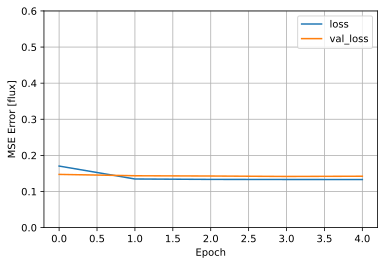
    


```python
test_results ={}
test_results['linear_model'] = linear_model.evaluate(
    X_test, y_test, verbose=0)
y_est = scaler_y_test.inverse_transform(linear_model.predict(X_test))
a = plt.axes
plt.scatter(scaler_y_test.inverse_transform(y_test),y_est)
plt.xlabel('True Values (umol/ms/s)')
plt.ylabel('Predictions (umol/ms/s)')
plt.ylim(-6, 6)   # set the xlim to left, right
plt.xlim(-6, 6)
var1=scaler_y_test.inverse_transform(y_test)
var2=y_est
print(np.corrcoef(var1,var2,rowvar=False))
```

    [[1.         0.63321278]
     [0.63321278 1.        ]]


    

    


```python
linear_model = Sequential()
linear_model.add(Dense(15,input_dim=X_full.shape[1], activation='sigmoid'))
linear_model.add(Dense(1,input_dim=X_full.shape[1], activation='sigmoid'))
x = tf.ones((1, X_full.shape[1]))
yt = linear_model(x)
print("Number of weights after calling the model:", len(linear_model.weights))
optimizer = keras.optimizers.Adam(0.1)
linear_model.compile(loss='mae', optimizer=optimizer, metrics=['mae'])

```

    Number of weights after calling the model: 4


```python
history = linear_model.fit(
    X_train, y_train,
    epochs=20,
    # suppress logging
    verbose=2,
    # Calculate validation results on 20% of the training data
    validation_split = 0.2)
plot_loss(history)
```

    Epoch 1/20
    6272/6272 - 5s - loss: 0.1110 - mae: 0.1110 - val_loss: 0.1177 - val_mae: 0.1177
    Epoch 2/20
    6272/6272 - 4s - loss: 0.1031 - mae: 0.1031 - val_loss: 0.1031 - val_mae: 0.1031
    Epoch 3/20
    6272/6272 - 4s - loss: 0.1017 - mae: 0.1017 - val_loss: 0.1190 - val_mae: 0.1190
    Epoch 4/20
    6272/6272 - 4s - loss: 0.1014 - mae: 0.1014 - val_loss: 0.1185 - val_mae: 0.1185
    Epoch 5/20
    6272/6272 - 4s - loss: 0.1013 - mae: 0.1013 - val_loss: 0.1055 - val_mae: 0.1055
    Epoch 6/20
    6272/6272 - 4s - loss: 0.1006 - mae: 0.1006 - val_loss: 0.1030 - val_mae: 0.1030
    Epoch 7/20
    6272/6272 - 4s - loss: 0.1007 - mae: 0.1007 - val_loss: 0.1241 - val_mae: 0.1241
    Epoch 8/20
    6272/6272 - 4s - loss: 0.1005 - mae: 0.1005 - val_loss: 0.1129 - val_mae: 0.1129
    Epoch 9/20
    6272/6272 - 4s - loss: 0.1000 - mae: 0.1000 - val_loss: 0.1238 - val_mae: 0.1238
    Epoch 10/20
    6272/6272 - 4s - loss: 0.0993 - mae: 0.0993 - val_loss: 0.1060 - val_mae: 0.1060
    Epoch 11/20
    6272/6272 - 4s - loss: 0.0986 - mae: 0.0986 - val_loss: 0.1022 - val_mae: 0.1022
    Epoch 12/20
    6272/6272 - 4s - loss: 0.0984 - mae: 0.0984 - val_loss: 0.1096 - val_mae: 0.1096
    Epoch 13/20
    6272/6272 - 4s - loss: 0.0980 - mae: 0.0980 - val_loss: 0.1175 - val_mae: 0.1175
    Epoch 14/20
    6272/6272 - 4s - loss: 0.0980 - mae: 0.0980 - val_loss: 0.1087 - val_mae: 0.1087
    Epoch 15/20
    6272/6272 - 4s - loss: 0.0981 - mae: 0.0981 - val_loss: 0.1096 - val_mae: 0.1096
    Epoch 16/20
    6272/6272 - 4s - loss: 0.0981 - mae: 0.0981 - val_loss: 0.1103 - val_mae: 0.1103
    Epoch 17/20
    6272/6272 - 4s - loss: 0.0979 - mae: 0.0979 - val_loss: 0.1170 - val_mae: 0.1170
    Epoch 18/20
    6272/6272 - 4s - loss: 0.0980 - mae: 0.0980 - val_loss: 0.1148 - val_mae: 0.1148
    Epoch 19/20
    6272/6272 - 4s - loss: 0.0977 - mae: 0.0977 - val_loss: 0.1078 - val_mae: 0.1078
    Epoch 20/20
    6272/6272 - 4s - loss: 0.0978 - mae: 0.0978 - val_loss: 0.1061 - val_mae: 0.1061


    

    


```python
test_results ={}
test_results['linear_model'] = linear_model.evaluate(
    X_test, y_test, verbose=0)
y_est = scaler_y_test.inverse_transform(linear_model.predict(X_test))
a = plt.axes
plt.scatter(scaler_y_test.inverse_transform(y_test),y_est )
plt.xlabel('True Values (umol/ms/s)')
plt.ylabel('Predictions (umol/ms/s)')
plt.ylim(-6, 6)
plt.xlim(-6, 6)
var1=scaler_y_test.inverse_transform(y_test)
var2=y_est
print(np.corrcoef(var1,var2,rowvar=False))

```

    [[1.         0.88992497]
     [0.88992497 1.        ]]


    

    


```python
col_names = var_names + ['SIF' , 'Month','Flux']
print(col_names)
df = pd.DataFrame(np.concatenate((X_narr_sif,flux_var),axis=1), columns = col_names)

train_dataset = df.sample(frac=0.8, random_state=0)
test_dataset = df.drop(train_dataset.index)

sns.pairplot(train_dataset[['sp_hum','soil_moisture','R_sw','vpd','temp','precip','precip_30d']], diag_kind='kde')
```

    ['sp_hum', 'precip', 'soil_moisture', 'R_sw', 'vpd', 'temp', 'precip_30d', 'SIF', 'Month', 'Flux']


    <seaborn.axisgrid.PairGrid at 0x7ff7b1c78be0>


    Error in callback <function flush_figures at 0x7ff7edd03550> (for post_execute):


    ---------------------------------------------------------------------------

    KeyboardInterrupt                         Traceback (most recent call last)

    ~/Library/Python/3.8/lib/python/site-packages/ipykernel/pylab/backend_inline.py in flush_figures()
        118         # ignore the tracking, just draw and close all figures
        119         try:
    --> 120             return show(True)
        121         except Exception as e:
        122             # safely show traceback if in IPython, else raise


    ~/Library/Python/3.8/lib/python/site-packages/ipykernel/pylab/backend_inline.py in show(close, block)
         38     try:
         39         for figure_manager in Gcf.get_all_fig_managers():
    ---> 40             display(
         41                 figure_manager.canvas.figure,
         42                 metadata=_fetch_figure_metadata(figure_manager.canvas.figure)


    ~/Library/Python/3.8/lib/python/site-packages/IPython/core/display.py in display(include, exclude, metadata, transient, display_id, *objs, **kwargs)
        311             publish_display_data(data=obj, metadata=metadata, **kwargs)
        312         else:
    --> 313             format_dict, md_dict = format(obj, include=include, exclude=exclude)
        314             if not format_dict:
        315                 # nothing to display (e.g. _ipython_display_ took over)


    ~/Library/Python/3.8/lib/python/site-packages/IPython/core/formatters.py in format(self, obj, include, exclude)
        178             md = None
        179             try:
    --> 180                 data = formatter(obj)
        181             except:
        182                 # FIXME: log the exception


    ~/Library/Python/3.8/lib/python/site-packages/decorator.py in fun(*args, **kw)
        230             if not kwsyntax:
        231                 args, kw = fix(args, kw, sig)
    --> 232             return caller(func, *(extras + args), **kw)
        233     fun.__name__ = func.__name__
        234     fun.__signature__ = sig


    ~/Library/Python/3.8/lib/python/site-packages/IPython/core/formatters.py in catch_format_error(method, self, *args, **kwargs)
        222     """show traceback on failed format call"""
        223     try:
    --> 224         r = method(self, *args, **kwargs)
        225     except NotImplementedError:
        226         # don't warn on NotImplementedErrors


    ~/Library/Python/3.8/lib/python/site-packages/IPython/core/formatters.py in __call__(self, obj)
        339                 pass
        340             else:
    --> 341                 return printer(obj)
        342             # Finally look for special method names
        343             method = get_real_method(obj, self.print_method)


    ~/Library/Python/3.8/lib/python/site-packages/IPython/core/pylabtools.py in <lambda>(fig)
        252         jpg_formatter.for_type(Figure, lambda fig: print_figure(fig, 'jpg', **kwargs))
        253     if 'svg' in formats:
    --> 254         svg_formatter.for_type(Figure, lambda fig: print_figure(fig, 'svg', **kwargs))
        255     if 'pdf' in formats:
        256         pdf_formatter.for_type(Figure, lambda fig: print_figure(fig, 'pdf', **kwargs))


    ~/Library/Python/3.8/lib/python/site-packages/IPython/core/pylabtools.py in print_figure(fig, fmt, bbox_inches, **kwargs)
        130         FigureCanvasBase(fig)
        131 
    --> 132     fig.canvas.print_figure(bytes_io, **kw)
        133     data = bytes_io.getvalue()
        134     if fmt == 'svg':


    /Library/Frameworks/Python.framework/Versions/3.8/lib/python3.8/site-packages/matplotlib/backend_bases.py in print_figure(self, filename, dpi, facecolor, edgecolor, orientation, format, bbox_inches, pad_inches, bbox_extra_artists, backend, **kwargs)
       2208 
       2209             try:
    -> 2210                 result = print_method(
       2211                     filename,
       2212                     dpi=dpi,


    /Library/Frameworks/Python.framework/Versions/3.8/lib/python3.8/site-packages/matplotlib/backends/backend_svg.py in print_svg(self, filename, *args, **kwargs)
       1316                 detach = True
       1317 
    -> 1318             self._print_svg(filename, fh, **kwargs)
       1319 
       1320             # Detach underlying stream from wrapper so that it remains open in


    /Library/Frameworks/Python.framework/Versions/3.8/lib/python3.8/site-packages/matplotlib/backend_bases.py in wrapper(*args, **kwargs)
       1637             kwargs.pop(arg)
       1638 
    -> 1639         return func(*args, **kwargs)
       1640 
       1641     return wrapper


    /Library/Frameworks/Python.framework/Versions/3.8/lib/python3.8/site-packages/matplotlib/backends/backend_svg.py in _print_svg(self, filename, fh, dpi, bbox_inches_restore, metadata)
       1340             bbox_inches_restore=bbox_inches_restore)
       1341 
    -> 1342         self.figure.draw(renderer)
       1343         renderer.finalize()
       1344 


    /Library/Frameworks/Python.framework/Versions/3.8/lib/python3.8/site-packages/matplotlib/artist.py in draw_wrapper(artist, renderer, *args, **kwargs)
         39                 renderer.start_filter()
         40 
    ---> 41             return draw(artist, renderer, *args, **kwargs)
         42         finally:
         43             if artist.get_agg_filter() is not None:


    /Library/Frameworks/Python.framework/Versions/3.8/lib/python3.8/site-packages/matplotlib/figure.py in draw(self, renderer)
       1861 
       1862             self.patch.draw(renderer)
    -> 1863             mimage._draw_list_compositing_images(
       1864                 renderer, self, artists, self.suppressComposite)
       1865 


    /Library/Frameworks/Python.framework/Versions/3.8/lib/python3.8/site-packages/matplotlib/image.py in _draw_list_compositing_images(renderer, parent, artists, suppress_composite)
        130     if not_composite or not has_images:
        131         for a in artists:
    --> 132             a.draw(renderer)
        133     else:
        134         # Composite any adjacent images together


    /Library/Frameworks/Python.framework/Versions/3.8/lib/python3.8/site-packages/matplotlib/artist.py in draw_wrapper(artist, renderer, *args, **kwargs)
         39                 renderer.start_filter()
         40 
    ---> 41             return draw(artist, renderer, *args, **kwargs)
         42         finally:
         43             if artist.get_agg_filter() is not None:


    /Library/Frameworks/Python.framework/Versions/3.8/lib/python3.8/site-packages/matplotlib/cbook/deprecation.py in wrapper(*inner_args, **inner_kwargs)
        409                          else deprecation_addendum,
        410                 **kwargs)
    --> 411         return func(*inner_args, **inner_kwargs)
        412 
        413     return wrapper


    /Library/Frameworks/Python.framework/Versions/3.8/lib/python3.8/site-packages/matplotlib/axes/_base.py in draw(self, renderer, inframe)
       2746             renderer.stop_rasterizing()
       2747 
    -> 2748         mimage._draw_list_compositing_images(renderer, self, artists)
       2749 
       2750         renderer.close_group('axes')


    /Library/Frameworks/Python.framework/Versions/3.8/lib/python3.8/site-packages/matplotlib/image.py in _draw_list_compositing_images(renderer, parent, artists, suppress_composite)
        130     if not_composite or not has_images:
        131         for a in artists:
    --> 132             a.draw(renderer)
        133     else:
        134         # Composite any adjacent images together


    /Library/Frameworks/Python.framework/Versions/3.8/lib/python3.8/site-packages/matplotlib/artist.py in draw_wrapper(artist, renderer, *args, **kwargs)
         39                 renderer.start_filter()
         40 
    ---> 41             return draw(artist, renderer, *args, **kwargs)
         42         finally:
         43             if artist.get_agg_filter() is not None:


    /Library/Frameworks/Python.framework/Versions/3.8/lib/python3.8/site-packages/matplotlib/collections.py in draw(self, renderer)
        929     def draw(self, renderer):
        930         self.set_sizes(self._sizes, self.figure.dpi)
    --> 931         Collection.draw(self, renderer)
        932 
        933 


    /Library/Frameworks/Python.framework/Versions/3.8/lib/python3.8/site-packages/matplotlib/artist.py in draw_wrapper(artist, renderer, *args, **kwargs)
         39                 renderer.start_filter()
         40 
    ---> 41             return draw(artist, renderer, *args, **kwargs)
         42         finally:
         43             if artist.get_agg_filter() is not None:


    /Library/Frameworks/Python.framework/Versions/3.8/lib/python3.8/site-packages/matplotlib/collections.py in draw(self, renderer)
        400             gc.set_antialiased(self._antialiaseds[0])
        401             gc.set_url(self._urls[0])
    --> 402             renderer.draw_markers(
        403                 gc, paths[0], combined_transform.frozen(),
        404                 mpath.Path(offsets), transOffset, tuple(facecolors[0]))


    /Library/Frameworks/Python.framework/Versions/3.8/lib/python3.8/site-packages/matplotlib/backends/backend_svg.py in draw_markers(self, gc, marker_path, marker_trans, path, trans, rgbFace)
        702                 attrib['x'] = short_float_fmt(x)
        703                 attrib['y'] = short_float_fmt(y)
    --> 704                 attrib['style'] = self._get_style(gc, rgbFace)
        705                 writer.element('use', attrib=attrib)
        706         writer.end('g')


    /Library/Frameworks/Python.framework/Versions/3.8/lib/python3.8/site-packages/matplotlib/backends/backend_svg.py in _get_style(self, gc, rgbFace)
        565 
        566     def _get_style(self, gc, rgbFace):
    --> 567         return generate_css(self._get_style_dict(gc, rgbFace))
        568 
        569     def _get_clip(self, gc):


    /Library/Frameworks/Python.framework/Versions/3.8/lib/python3.8/site-packages/matplotlib/backends/backend_svg.py in _get_style_dict(self, gc, rgbFace)
        535             else:
        536                 if tuple(rgbFace[:3]) != (0, 0, 0):
    --> 537                     attrib['fill'] = rgb2hex(rgbFace)
        538                 if (len(rgbFace) == 4 and rgbFace[3] != 1.0
        539                         and not forced_alpha):


    /Library/Frameworks/Python.framework/Versions/3.8/lib/python3.8/site-packages/matplotlib/colors.py in to_hex(c, keep_alpha)
        357     if not keep_alpha:
        358         c = c[:3]
    --> 359     return "#" + "".join(format(int(round(val * 255)), "02x") for val in c)
        360 
        361 


    /Library/Frameworks/Python.framework/Versions/3.8/lib/python3.8/site-packages/matplotlib/colors.py in <genexpr>(.0)
        357     if not keep_alpha:
        358         c = c[:3]
    --> 359     return "#" + "".join(format(int(round(val * 255)), "02x") for val in c)
        360 
        361 


    KeyboardInterrupt: 


```python

# https://stackoverflow.com/questions/53697814/using-pip-install-to-install-cartopy-but-missing-proj-version-at-least-4-9-0
# https://stackoverflow.com/questions/45632549/why-is-the-accuracy-for-my-keras-model-always-0-when-training
# https://stackoverflow.com/questions/61980349/tensorflow-typeerror-cannot-unpack-non-iterable-float-object
# https://www.tensorflow.org/guide/keras/train_and_evaluate
```


```python
var_names = ['sp_hum','precip','soil_moisture','vpd','temp','precip_30d']


final = []
# loop over variable names
for i in range(0, len(var_names)):
    final.append([])
    for number in range(2007, 2016):
        #print(number)
        filename_narr = data_dir + "predictors/narr-%d-NA-monthly.nc" % number
        nc_narr = Dataset(filename_narr, 'r')
        #print(i)
        narr_var = np.array(nc_narr.variables["{}".format(var_names[i])])
        num_rows, num_cols = narr_var.shape
        final[i].extend(narr_var.reshape((num_rows*num_cols, 1),order='F'))

# print(len(final))
# print(len(final[0]))
# print(len(final[0][0]))
X2 = np.array(final) # create numpy array from list

# print(X.shape)
X2 = np.transpose(np.squeeze(X2)) # transpose and remove singular dimension (squeeze)
print(X2.shape)


# double check shape/reshape order

# plot monthly average
print(flux_var.shape)


b = np.reshape(np.ravel(X2[:,3], order='F'), (2613,12,9,-1),order='F')

b = np.mean(b,axis=0)

print(b.shape)

b = np.mean(b,axis=1)

mon_array = np.arange(1, 13, dtype=float)

# remove nirv_var
X_full = X2


X_train = X_full[0:2613*8*12,:] # train on first 8 years
y_train = flux_var[0:2613*8*12] # train on first 8 years

X_test = X_full[2613*8*12:,:] # test on last year
y_test = flux_var[2613*8*12:] # test on last year

# transform for NN

# scaler_x = preprocessing.StandardScaler() # scaling zero mean unit variance
#scaler_y = preprocessing.StandardScaler() # scaling zero mean unit variance

# scale predictors between 0-1
scaler_x_train = preprocessing.MinMaxScaler(feature_range=(0, 1))
scaler_x_train.fit(X_train)
#scaler_y_train = preprocessing.MinMaxScaler(feature_range=(0, 1))

# try quantile transformation of flux data see: https://machinelearningmastery.com/quantile-transforms-for-machine-learning/
scaler_y_train = QuantileTransformer(random_state=0)
scaler_y_train.fit(y_train)

X_train = scaler_x_train.fit_transform(X_train) # transform training predictors data
y_train = scaler_y_train.fit_transform(y_train) # transform training flux data

scaler_x_test = preprocessing.MinMaxScaler(feature_range=(0, 1))
scaler_x_test.fit(X_test)

#scaler_y_test = preprocessing.MinMaxScaler(feature_range=(0, 1))
scaler_y_test = QuantileTransformer(random_state=0)
scaler_y_test.fit(y_test)


X_test = scaler_x_test.fit_transform(X_test) # transform test predictors data
y_test = scaler_y_test.fit_transform(y_test) # transform test flux data

print(X_train.shape)
print(y_train.shape)

print(X_test.shape)
print(y_test.shape)

med_model = Sequential()
med_model.add(Dense(50,input_dim=X_full.shape[1], activation='relu'))
med_model.add(Dense(70,input_dim=X_full.shape[1], activation='relu'))
med_model.add(Dense(70,input_dim=X_full.shape[1], activation='relu'))
med_model.add(Dense(50,input_dim=X_full.shape[1], activation='relu'))
med_model.add(Dense(1,input_dim=X_full.shape[1], activation='linear'))
x = tf.ones((1, X_full.shape[1]))
yt = med_model(x)
optimizer = keras.optimizers.Adam()
med_model.compile(loss='mae', optimizer=optimizer, metrics=['mae'])

med_model_history=med_model.fit(
    X_train, y_train,
    epochs=100,
    verbose=2,
    batch_size=256,
    shuffle = True,

   validation_data=(X_test, y_test))
    
test_results ={}
test_results['med_model'] = med_model.evaluate(
    X_test, y_test, verbose=0)
y_est = scaler_y_test.inverse_transform(med_model.predict(X_test))
a = plt.axes
#     axs[i-1].xlabel('True Values')
#     axs[i-1].ylabel('Predictions')
#     axs[i-1].ylim(-6, 6)
#     axs[i-1].xlim(-6, 6)
var1=scaler_y_test.inverse_transform(y_test)
var2=y_est
a = plt.axes
plt.scatter(scaler_y_test.inverse_transform(y_test),y_est )
plt.xlabel('True Values')
plt.ylabel('Predictions')
plt.ylim(-6, 6)
plt.xlim(-6, 6)
var1=scaler_y_test.inverse_transform(y_test)
var2=y_est
print(np.corrcoef(var1,var2,rowvar=False))
```

    (282204, 6)
    (282204, 1)
    (12, 9, 1)
    (250848, 6)
    (250848, 1)
    (31356, 6)
    (31356, 1)
    Epoch 1/100
    980/980 - 1s - loss: 0.1851 - mae: 0.1851 - val_loss: 0.1840 - val_mae: 0.1840
    Epoch 2/100
    980/980 - 1s - loss: 0.1704 - mae: 0.1704 - val_loss: 0.1761 - val_mae: 0.1761
    Epoch 3/100
    980/980 - 1s - loss: 0.1675 - mae: 0.1675 - val_loss: 0.1756 - val_mae: 0.1756
    Epoch 4/100
    980/980 - 1s - loss: 0.1656 - mae: 0.1656 - val_loss: 0.1719 - val_mae: 0.1719
    Epoch 5/100
    980/980 - 1s - loss: 0.1637 - mae: 0.1637 - val_loss: 0.1736 - val_mae: 0.1736
    Epoch 6/100
    980/980 - 1s - loss: 0.1624 - mae: 0.1624 - val_loss: 0.1732 - val_mae: 0.1732
    Epoch 7/100
    980/980 - 1s - loss: 0.1615 - mae: 0.1615 - val_loss: 0.1752 - val_mae: 0.1752
    Epoch 8/100
    980/980 - 1s - loss: 0.1604 - mae: 0.1604 - val_loss: 0.1723 - val_mae: 0.1723
    Epoch 9/100
    980/980 - 1s - loss: 0.1595 - mae: 0.1595 - val_loss: 0.1759 - val_mae: 0.1759
    Epoch 10/100
    980/980 - 1s - loss: 0.1585 - mae: 0.1585 - val_loss: 0.1718 - val_mae: 0.1718
    Epoch 11/100
    980/980 - 1s - loss: 0.1580 - mae: 0.1580 - val_loss: 0.1721 - val_mae: 0.1721
    Epoch 12/100
    980/980 - 1s - loss: 0.1576 - mae: 0.1576 - val_loss: 0.1743 - val_mae: 0.1743
    Epoch 13/100
    980/980 - 1s - loss: 0.1565 - mae: 0.1565 - val_loss: 0.1717 - val_mae: 0.1717
    Epoch 14/100
    980/980 - 1s - loss: 0.1559 - mae: 0.1559 - val_loss: 0.1729 - val_mae: 0.1729
    Epoch 15/100
    980/980 - 1s - loss: 0.1555 - mae: 0.1555 - val_loss: 0.1744 - val_mae: 0.1744
    Epoch 16/100
    980/980 - 1s - loss: 0.1547 - mae: 0.1547 - val_loss: 0.1707 - val_mae: 0.1707
    Epoch 17/100
    980/980 - 1s - loss: 0.1543 - mae: 0.1543 - val_loss: 0.1745 - val_mae: 0.1745
    Epoch 18/100
    980/980 - 1s - loss: 0.1541 - mae: 0.1541 - val_loss: 0.1749 - val_mae: 0.1749
    Epoch 19/100
    980/980 - 1s - loss: 0.1539 - mae: 0.1539 - val_loss: 0.1780 - val_mae: 0.1780
    Epoch 20/100
    980/980 - 1s - loss: 0.1530 - mae: 0.1530 - val_loss: 0.1752 - val_mae: 0.1752
    Epoch 21/100
    980/980 - 1s - loss: 0.1530 - mae: 0.1530 - val_loss: 0.1736 - val_mae: 0.1736
    Epoch 22/100
    980/980 - 1s - loss: 0.1529 - mae: 0.1529 - val_loss: 0.1725 - val_mae: 0.1725
    Epoch 23/100
    980/980 - 1s - loss: 0.1525 - mae: 0.1525 - val_loss: 0.1680 - val_mae: 0.1680
    Epoch 24/100
    980/980 - 1s - loss: 0.1522 - mae: 0.1522 - val_loss: 0.1763 - val_mae: 0.1763
    Epoch 25/100
    980/980 - 1s - loss: 0.1518 - mae: 0.1518 - val_loss: 0.1772 - val_mae: 0.1772
    Epoch 26/100
    980/980 - 1s - loss: 0.1515 - mae: 0.1515 - val_loss: 0.1749 - val_mae: 0.1749
    Epoch 27/100
    980/980 - 1s - loss: 0.1513 - mae: 0.1513 - val_loss: 0.1735 - val_mae: 0.1735
    Epoch 28/100
    980/980 - 1s - loss: 0.1510 - mae: 0.1510 - val_loss: 0.1733 - val_mae: 0.1733
    Epoch 29/100
    980/980 - 1s - loss: 0.1507 - mae: 0.1507 - val_loss: 0.1720 - val_mae: 0.1720
    Epoch 30/100
    980/980 - 1s - loss: 0.1503 - mae: 0.1503 - val_loss: 0.1738 - val_mae: 0.1738
    Epoch 31/100
    980/980 - 1s - loss: 0.1503 - mae: 0.1503 - val_loss: 0.1755 - val_mae: 0.1755
    Epoch 32/100
    980/980 - 1s - loss: 0.1500 - mae: 0.1500 - val_loss: 0.1727 - val_mae: 0.1727
    Epoch 33/100
    980/980 - 1s - loss: 0.1497 - mae: 0.1497 - val_loss: 0.1727 - val_mae: 0.1727
    Epoch 34/100
    980/980 - 1s - loss: 0.1498 - mae: 0.1498 - val_loss: 0.1710 - val_mae: 0.1710
    Epoch 35/100
    980/980 - 1s - loss: 0.1494 - mae: 0.1494 - val_loss: 0.1765 - val_mae: 0.1765
    Epoch 36/100
    980/980 - 1s - loss: 0.1490 - mae: 0.1490 - val_loss: 0.1731 - val_mae: 0.1731
    Epoch 37/100
    980/980 - 1s - loss: 0.1492 - mae: 0.1492 - val_loss: 0.1738 - val_mae: 0.1738
    Epoch 38/100
    980/980 - 1s - loss: 0.1486 - mae: 0.1486 - val_loss: 0.1774 - val_mae: 0.1774
    Epoch 39/100
    980/980 - 1s - loss: 0.1481 - mae: 0.1481 - val_loss: 0.1728 - val_mae: 0.1728
    Epoch 40/100
    980/980 - 1s - loss: 0.1484 - mae: 0.1484 - val_loss: 0.1700 - val_mae: 0.1700
    Epoch 41/100
    980/980 - 1s - loss: 0.1483 - mae: 0.1483 - val_loss: 0.1747 - val_mae: 0.1747
    Epoch 42/100
    980/980 - 1s - loss: 0.1477 - mae: 0.1477 - val_loss: 0.1699 - val_mae: 0.1699
    Epoch 43/100
    980/980 - 1s - loss: 0.1477 - mae: 0.1477 - val_loss: 0.1746 - val_mae: 0.1746
    Epoch 44/100
    980/980 - 1s - loss: 0.1476 - mae: 0.1476 - val_loss: 0.1776 - val_mae: 0.1776
    Epoch 45/100
    980/980 - 1s - loss: 0.1477 - mae: 0.1477 - val_loss: 0.1723 - val_mae: 0.1723
    Epoch 46/100
    980/980 - 1s - loss: 0.1471 - mae: 0.1471 - val_loss: 0.1704 - val_mae: 0.1704
    Epoch 47/100
    980/980 - 1s - loss: 0.1474 - mae: 0.1474 - val_loss: 0.1733 - val_mae: 0.1733
    Epoch 48/100
    980/980 - 1s - loss: 0.1472 - mae: 0.1472 - val_loss: 0.1709 - val_mae: 0.1709
    Epoch 49/100
    980/980 - 1s - loss: 0.1468 - mae: 0.1468 - val_loss: 0.1771 - val_mae: 0.1771
    Epoch 50/100
    980/980 - 1s - loss: 0.1469 - mae: 0.1469 - val_loss: 0.1729 - val_mae: 0.1729
    Epoch 51/100
    980/980 - 1s - loss: 0.1463 - mae: 0.1463 - val_loss: 0.1787 - val_mae: 0.1787
    Epoch 52/100
    980/980 - 1s - loss: 0.1465 - mae: 0.1465 - val_loss: 0.1727 - val_mae: 0.1727
    Epoch 53/100
    980/980 - 1s - loss: 0.1462 - mae: 0.1462 - val_loss: 0.1744 - val_mae: 0.1744
    Epoch 54/100
    980/980 - 1s - loss: 0.1466 - mae: 0.1466 - val_loss: 0.1762 - val_mae: 0.1762
    Epoch 55/100
    980/980 - 1s - loss: 0.1462 - mae: 0.1462 - val_loss: 0.1742 - val_mae: 0.1742
    Epoch 56/100
    980/980 - 1s - loss: 0.1459 - mae: 0.1459 - val_loss: 0.1781 - val_mae: 0.1781
    Epoch 57/100
    980/980 - 1s - loss: 0.1458 - mae: 0.1458 - val_loss: 0.1743 - val_mae: 0.1743
    Epoch 58/100
    980/980 - 1s - loss: 0.1456 - mae: 0.1456 - val_loss: 0.1729 - val_mae: 0.1729
    Epoch 59/100
    980/980 - 1s - loss: 0.1455 - mae: 0.1455 - val_loss: 0.1741 - val_mae: 0.1741
    Epoch 60/100
    980/980 - 1s - loss: 0.1455 - mae: 0.1455 - val_loss: 0.1724 - val_mae: 0.1724
    Epoch 61/100
    980/980 - 1s - loss: 0.1454 - mae: 0.1454 - val_loss: 0.1754 - val_mae: 0.1754
    Epoch 62/100
    980/980 - 1s - loss: 0.1452 - mae: 0.1452 - val_loss: 0.1740 - val_mae: 0.1740
    Epoch 63/100
    980/980 - 1s - loss: 0.1446 - mae: 0.1446 - val_loss: 0.1742 - val_mae: 0.1742
    Epoch 64/100
    980/980 - 1s - loss: 0.1448 - mae: 0.1448 - val_loss: 0.1757 - val_mae: 0.1757
    Epoch 65/100
    980/980 - 1s - loss: 0.1448 - mae: 0.1448 - val_loss: 0.1795 - val_mae: 0.1795
    Epoch 66/100
    980/980 - 1s - loss: 0.1445 - mae: 0.1445 - val_loss: 0.1754 - val_mae: 0.1754
    Epoch 67/100
    980/980 - 1s - loss: 0.1445 - mae: 0.1445 - val_loss: 0.1743 - val_mae: 0.1743
    Epoch 68/100
    980/980 - 1s - loss: 0.1444 - mae: 0.1444 - val_loss: 0.1742 - val_mae: 0.1742
    Epoch 69/100
    980/980 - 1s - loss: 0.1440 - mae: 0.1440 - val_loss: 0.1710 - val_mae: 0.1710
    Epoch 70/100
    980/980 - 1s - loss: 0.1442 - mae: 0.1442 - val_loss: 0.1722 - val_mae: 0.1722
    Epoch 71/100
    980/980 - 1s - loss: 0.1442 - mae: 0.1442 - val_loss: 0.1740 - val_mae: 0.1740
    Epoch 72/100
    980/980 - 1s - loss: 0.1444 - mae: 0.1444 - val_loss: 0.1766 - val_mae: 0.1766
    Epoch 73/100
    980/980 - 1s - loss: 0.1439 - mae: 0.1439 - val_loss: 0.1735 - val_mae: 0.1735
    Epoch 74/100
    980/980 - 1s - loss: 0.1440 - mae: 0.1440 - val_loss: 0.1767 - val_mae: 0.1767
    Epoch 75/100
    980/980 - 1s - loss: 0.1439 - mae: 0.1439 - val_loss: 0.1739 - val_mae: 0.1739
    Epoch 76/100
    980/980 - 1s - loss: 0.1438 - mae: 0.1438 - val_loss: 0.1739 - val_mae: 0.1739
    Epoch 77/100
    980/980 - 1s - loss: 0.1432 - mae: 0.1432 - val_loss: 0.1739 - val_mae: 0.1739
    Epoch 78/100
    980/980 - 1s - loss: 0.1435 - mae: 0.1435 - val_loss: 0.1729 - val_mae: 0.1729
    Epoch 79/100
    980/980 - 1s - loss: 0.1432 - mae: 0.1432 - val_loss: 0.1738 - val_mae: 0.1738
    Epoch 80/100
    980/980 - 1s - loss: 0.1431 - mae: 0.1431 - val_loss: 0.1764 - val_mae: 0.1764
    Epoch 81/100
    980/980 - 1s - loss: 0.1433 - mae: 0.1433 - val_loss: 0.1721 - val_mae: 0.1721
    Epoch 82/100
    980/980 - 1s - loss: 0.1433 - mae: 0.1433 - val_loss: 0.1705 - val_mae: 0.1705
    Epoch 83/100
    980/980 - 1s - loss: 0.1432 - mae: 0.1432 - val_loss: 0.1753 - val_mae: 0.1753
    Epoch 84/100
    980/980 - 1s - loss: 0.1428 - mae: 0.1428 - val_loss: 0.1733 - val_mae: 0.1733
    Epoch 85/100
    980/980 - 1s - loss: 0.1431 - mae: 0.1431 - val_loss: 0.1764 - val_mae: 0.1764
    Epoch 86/100
    980/980 - 1s - loss: 0.1428 - mae: 0.1428 - val_loss: 0.1777 - val_mae: 0.1777
    Epoch 87/100
    980/980 - 1s - loss: 0.1426 - mae: 0.1426 - val_loss: 0.1758 - val_mae: 0.1758
    Epoch 88/100
    980/980 - 1s - loss: 0.1423 - mae: 0.1423 - val_loss: 0.1759 - val_mae: 0.1759
    Epoch 89/100
    980/980 - 1s - loss: 0.1424 - mae: 0.1424 - val_loss: 0.1748 - val_mae: 0.1748
    Epoch 90/100
    980/980 - 1s - loss: 0.1427 - mae: 0.1427 - val_loss: 0.1714 - val_mae: 0.1714
    Epoch 91/100
    980/980 - 1s - loss: 0.1421 - mae: 0.1421 - val_loss: 0.1773 - val_mae: 0.1773
    Epoch 92/100
    980/980 - 1s - loss: 0.1423 - mae: 0.1423 - val_loss: 0.1774 - val_mae: 0.1774
    Epoch 93/100
    980/980 - 1s - loss: 0.1424 - mae: 0.1424 - val_loss: 0.1737 - val_mae: 0.1737
    Epoch 94/100
    980/980 - 1s - loss: 0.1421 - mae: 0.1421 - val_loss: 0.1791 - val_mae: 0.1791
    Epoch 95/100
    980/980 - 1s - loss: 0.1422 - mae: 0.1422 - val_loss: 0.1748 - val_mae: 0.1748
    Epoch 96/100
    980/980 - 1s - loss: 0.1419 - mae: 0.1419 - val_loss: 0.1701 - val_mae: 0.1701
    Epoch 97/100
    980/980 - 1s - loss: 0.1419 - mae: 0.1419 - val_loss: 0.1756 - val_mae: 0.1756
    Epoch 98/100
    980/980 - 1s - loss: 0.1420 - mae: 0.1420 - val_loss: 0.1716 - val_mae: 0.1716
    Epoch 99/100
    980/980 - 1s - loss: 0.1417 - mae: 0.1417 - val_loss: 0.1743 - val_mae: 0.1743
    Epoch 100/100
    980/980 - 1s - loss: 0.1420 - mae: 0.1420 - val_loss: 0.1765 - val_mae: 0.1765
    [[1.         0.56804554]
     [0.56804554 1.        ]]


    

    


```python
a = np.reshape(np.ravel(y_est, order='F'), (2613,12,1,-1),order='F') 

xi, yi, zi_flux = data2grid(lats,lons,a[:,6]) # regrid for plotting
#xi, yi, zi_flux = data2grid(lats,lons,flux) # regrid for plotting

# projection axis  
ax = plt.axes(projection=ccrs.PlateCarree())
levels = np.linspace(-4, 4, 15)


# plot contour of variable using gridded  lat, lon, and variable
plt.contourf(xi, yi, zi_flux, 60,levels=levels,
             transform=ccrs.PlateCarree(),extend='both')
# plt.clim(-1.6,1.6)

# add coasts
ax.coastlines()

# title
plt.title("Carbon flux estimates average")
cbr=plt.colorbar()
cbr.set_label('(umol/ms/s)')
plt.show()
```


    
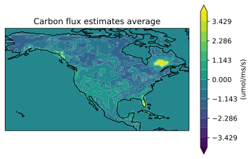
    


```python
realvals = np.reshape(np.ravel(scaler_y_test.inverse_transform(y_test), order='F'), (2613,12,1,-1),order='F') 

xi, yi, zi_flux = data2grid(lats,lons,realvals[:,6]) 

ax = plt.axes(projection=ccrs.PlateCarree())
levels = np.linspace(-4, 4, 15)

plt.contourf(xi, yi, zi_flux, 60,levels=levels,
             transform=ccrs.PlateCarree(),extend='both')

ax.coastlines()

plt.title("Carbon flux true values average")
cbr=plt.colorbar()
cbr.set_label('(umol/ms/s)')
plt.show()
```


    
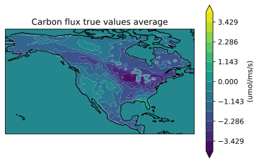
    


```python
from keras.layers import BatchNormalization
from keras.layers import Dropout
var_names = ['sp_hum','precip','soil_moisture','vpd','temp','precip_30d', 'R_sw', 'rel_hum']

# R_sw

final = []
# loop over variable names
for i in range(0, len(var_names)):
    final.append([])
    for number in range(2007, 2016):
        #print(number)
        filename_narr = data_dir + "predictors/narr-%d-NA-monthly.nc" % number
        nc_narr = Dataset(filename_narr, 'r')
        #print(i)
        narr_var = np.array(nc_narr.variables["{}".format(var_names[i])])
        num_rows, num_cols = narr_var.shape
        final[i].extend(narr_var.reshape((num_rows*num_cols, 1),order='F'))

# print(len(final))
# print(len(final[0]))
# print(len(final[0][0]))
X2 = np.array(final) # create numpy array from list

# print(X.shape)
X2 = np.transpose(np.squeeze(X2)) # transpose and remove singular dimension (squeeze)
print(X2.shape)


# double check shape/reshape order

# plot monthly average
print(flux_var.shape)


b = np.reshape(np.ravel(X2[:,3], order='F'), (2613,12,9,-1),order='F')

b = np.mean(b,axis=0)

print(b.shape)

b = np.mean(b,axis=1)

mon_array = np.arange(1, 13, dtype=float)

X_pars = np.concatenate((X2[:,3:6],month_vec),axis=1) # radiation, vpd, temp, 30d precip
X_narr = np.concatenate((X2,month_vec),axis=1) # All NARR
X_narr_sif = np.concatenate((X2,sif_var2A,month_vec),axis=1) # ALL NARR plus sif


X_full = np.concatenate((X2,sif_var2A,nirv_var),axis=1)
print(X_full.shape[1])


X_train = X_full[0:2613*8*12,:] # train on first 8 years
y_train = flux_var[0:2613*8*12] # train on first 8 years

X_test = X_full[2613*8*12:,:] # test on last year
y_test = flux_var[2613*8*12:] # test on last year

# transform for NN

# scaler_x = preprocessing.StandardScaler() # scaling zero mean unit variance
#scaler_y = preprocessing.StandardScaler() # scaling zero mean unit variance

# scale predictors between 0-1
scaler_x_train = preprocessing.MinMaxScaler(feature_range=(0, 1))
scaler_x_train.fit(X_train)
#scaler_y_train = preprocessing.MinMaxScaler(feature_range=(0, 1))

# try quantile transformation of flux data see: https://machinelearningmastery.com/quantile-transforms-for-machine-learning/
scaler_y_train = QuantileTransformer(random_state=0)
scaler_y_train.fit(y_train)

X_train = scaler_x_train.fit_transform(X_train) # transform training predictors data
y_train = scaler_y_train.fit_transform(y_train) # transform training flux data

scaler_x_test = preprocessing.MinMaxScaler(feature_range=(0, 1))
scaler_x_test.fit(X_test)

#scaler_y_test = preprocessing.MinMaxScaler(feature_range=(0, 1))
scaler_y_test = QuantileTransformer(random_state=0)
scaler_y_test.fit(y_test)


X_test = scaler_x_test.fit_transform(X_test) # transform test predictors data
y_test = scaler_y_test.fit_transform(y_test) # transform test flux data

print(X_train.shape)
print(y_train.shape)

print(X_test.shape)
print(y_test.shape)

large_model = Sequential()
large_model.add(Dense(50,input_dim=X_full.shape[1], activation='relu'))
large_model.add(BatchNormalization())
large_model.add(Dropout(.25))
large_model.add(Dense(100,input_dim=X_full.shape[1], activation='relu'))
large_model.add(BatchNormalization())
large_model.add(Dropout(.25))
large_model.add(Dense(100,input_dim=X_full.shape[1], activation='relu'))
large_model.add(BatchNormalization())
large_model.add(Dropout(.25))
large_model.add(Dense(100,input_dim=X_full.shape[1], activation='relu'))
large_model.add(BatchNormalization())
large_model.add(Dropout(.25))
large_model.add(Dense(50,input_dim=X_full.shape[1], activation='relu'))
large_model.add(BatchNormalization())
large_model.add(Dropout(.25))
large_model.add(Dense(50,input_dim=X_full.shape[1], activation='relu'))
large_model.add(BatchNormalization())
large_model.add(Dropout(.25))
large_model.add(Dense(1,input_dim=X_full.shape[1], activation='linear'))
x = tf.ones((1, X_full.shape[1]))
yt = large_model(x)
optimizer = keras.optimizers.Adam()
large_model.compile(loss='mae', optimizer=optimizer, metrics=['mae'])

large_model_history=large_model.fit(
    X_train, y_train,
    epochs=100,
    verbose=2,
    batch_size=256,
    shuffle = True,

   validation_data=(X_test, y_test))
    
test_results ={}
test_results['large_model'] = large_model.evaluate(
    X_test, y_test, verbose=0)
y_est = scaler_y_test.inverse_transform(large_model.predict(X_test))
a = plt.axes
#     axs[i-1].xlabel('True Values')
#     axs[i-1].ylabel('Predictions')
#     axs[i-1].ylim(-6, 6)
#     axs[i-1].xlim(-6, 6)
var1=scaler_y_test.inverse_transform(y_test)
var2=y_est
a = plt.axes
plt.scatter(scaler_y_test.inverse_transform(y_test),y_est )
plt.xlabel('True Values (umol/ms/s)')
plt.ylabel('Predictions (umol/ms/s)')
plt.ylim(-6, 6)
plt.xlim(-6, 6)
var1=scaler_y_test.inverse_transform(y_test)
var2=y_est
print(np.corrcoef(var1,var2,rowvar=False))

# 0.813  without batch normalization and dropout

```

    (282204, 8)
    (282204, 1)
    (12, 9, 1)
    10
    (250848, 10)
    (250848, 1)
    (31356, 10)
    (31356, 1)
    Epoch 1/100
    980/980 - 5s - loss: 0.2870 - mae: 0.2870 - val_loss: 0.1340 - val_mae: 0.1340
    Epoch 2/100
    980/980 - 5s - loss: 0.1525 - mae: 0.1525 - val_loss: 0.1285 - val_mae: 0.1285
    Epoch 3/100
    980/980 - 4s - loss: 0.1441 - mae: 0.1441 - val_loss: 0.1227 - val_mae: 0.1227
    Epoch 4/100
    980/980 - 4s - loss: 0.1390 - mae: 0.1390 - val_loss: 0.1189 - val_mae: 0.1189
    Epoch 5/100
    980/980 - 4s - loss: 0.1354 - mae: 0.1354 - val_loss: 0.1187 - val_mae: 0.1187
    Epoch 6/100
    980/980 - 4s - loss: 0.1326 - mae: 0.1326 - val_loss: 0.1175 - val_mae: 0.1175
    Epoch 7/100
    980/980 - 5s - loss: 0.1303 - mae: 0.1303 - val_loss: 0.1184 - val_mae: 0.1184
    Epoch 8/100
    980/980 - 5s - loss: 0.1286 - mae: 0.1286 - val_loss: 0.1150 - val_mae: 0.1150
    Epoch 9/100
    980/980 - 5s - loss: 0.1266 - mae: 0.1266 - val_loss: 0.1151 - val_mae: 0.1151
    Epoch 10/100
    980/980 - 4s - loss: 0.1257 - mae: 0.1257 - val_loss: 0.1206 - val_mae: 0.1206
    Epoch 11/100
    980/980 - 4s - loss: 0.1244 - mae: 0.1244 - val_loss: 0.1160 - val_mae: 0.1160
    Epoch 12/100
    980/980 - 4s - loss: 0.1238 - mae: 0.1238 - val_loss: 0.1118 - val_mae: 0.1118
    Epoch 13/100
    980/980 - 4s - loss: 0.1228 - mae: 0.1228 - val_loss: 0.1172 - val_mae: 0.1172
    Epoch 14/100
    980/980 - 4s - loss: 0.1223 - mae: 0.1223 - val_loss: 0.1188 - val_mae: 0.1188
    Epoch 15/100
    980/980 - 4s - loss: 0.1218 - mae: 0.1218 - val_loss: 0.1164 - val_mae: 0.1164
    Epoch 16/100
    980/980 - 4s - loss: 0.1216 - mae: 0.1216 - val_loss: 0.1141 - val_mae: 0.1141
    Epoch 17/100
    980/980 - 4s - loss: 0.1214 - mae: 0.1214 - val_loss: 0.1185 - val_mae: 0.1185
    Epoch 18/100
    980/980 - 4s - loss: 0.1206 - mae: 0.1206 - val_loss: 0.1172 - val_mae: 0.1172
    Epoch 19/100
    980/980 - 4s - loss: 0.1200 - mae: 0.1200 - val_loss: 0.1159 - val_mae: 0.1159
    Epoch 20/100
    980/980 - 4s - loss: 0.1200 - mae: 0.1200 - val_loss: 0.1109 - val_mae: 0.1109
    Epoch 21/100
    980/980 - 4s - loss: 0.1198 - mae: 0.1198 - val_loss: 0.1177 - val_mae: 0.1177
    Epoch 22/100
    980/980 - 4s - loss: 0.1195 - mae: 0.1195 - val_loss: 0.1151 - val_mae: 0.1151
    Epoch 23/100
    980/980 - 4s - loss: 0.1193 - mae: 0.1193 - val_loss: 0.1114 - val_mae: 0.1114
    Epoch 24/100
    980/980 - 4s - loss: 0.1191 - mae: 0.1191 - val_loss: 0.1100 - val_mae: 0.1100
    Epoch 25/100
    980/980 - 4s - loss: 0.1188 - mae: 0.1188 - val_loss: 0.1164 - val_mae: 0.1164
    Epoch 26/100
    980/980 - 4s - loss: 0.1186 - mae: 0.1186 - val_loss: 0.1154 - val_mae: 0.1154
    Epoch 27/100
    980/980 - 4s - loss: 0.1184 - mae: 0.1184 - val_loss: 0.1175 - val_mae: 0.1175
    Epoch 28/100
    980/980 - 4s - loss: 0.1181 - mae: 0.1181 - val_loss: 0.1149 - val_mae: 0.1149
    Epoch 29/100
    980/980 - 4s - loss: 0.1179 - mae: 0.1179 - val_loss: 0.1109 - val_mae: 0.1109
    Epoch 30/100
    980/980 - 4s - loss: 0.1180 - mae: 0.1180 - val_loss: 0.1144 - val_mae: 0.1144
    Epoch 31/100
    980/980 - 4s - loss: 0.1178 - mae: 0.1178 - val_loss: 0.1134 - val_mae: 0.1134
    Epoch 32/100
    980/980 - 4s - loss: 0.1179 - mae: 0.1179 - val_loss: 0.1115 - val_mae: 0.1115
    Epoch 33/100
    980/980 - 4s - loss: 0.1177 - mae: 0.1177 - val_loss: 0.1124 - val_mae: 0.1124
    Epoch 34/100
    980/980 - 4s - loss: 0.1176 - mae: 0.1176 - val_loss: 0.1184 - val_mae: 0.1184
    Epoch 35/100
    980/980 - 4s - loss: 0.1172 - mae: 0.1172 - val_loss: 0.1118 - val_mae: 0.1118
    Epoch 36/100
    980/980 - 4s - loss: 0.1172 - mae: 0.1172 - val_loss: 0.1120 - val_mae: 0.1120
    Epoch 37/100
    980/980 - 4s - loss: 0.1172 - mae: 0.1172 - val_loss: 0.1125 - val_mae: 0.1125
    Epoch 38/100
    980/980 - 4s - loss: 0.1171 - mae: 0.1171 - val_loss: 0.1151 - val_mae: 0.1151
    Epoch 39/100
    980/980 - 4s - loss: 0.1167 - mae: 0.1167 - val_loss: 0.1138 - val_mae: 0.1138
    Epoch 40/100
    980/980 - 4s - loss: 0.1169 - mae: 0.1169 - val_loss: 0.1138 - val_mae: 0.1138
    Epoch 41/100
    980/980 - 4s - loss: 0.1170 - mae: 0.1170 - val_loss: 0.1172 - val_mae: 0.1172
    Epoch 42/100
    980/980 - 5s - loss: 0.1167 - mae: 0.1167 - val_loss: 0.1133 - val_mae: 0.1133
    Epoch 43/100
    980/980 - 5s - loss: 0.1167 - mae: 0.1167 - val_loss: 0.1110 - val_mae: 0.1110
    Epoch 44/100
    980/980 - 4s - loss: 0.1166 - mae: 0.1166 - val_loss: 0.1218 - val_mae: 0.1218
    Epoch 45/100
    980/980 - 4s - loss: 0.1164 - mae: 0.1164 - val_loss: 0.1196 - val_mae: 0.1196
    Epoch 46/100
    980/980 - 17s - loss: 0.1163 - mae: 0.1163 - val_loss: 0.1143 - val_mae: 0.1143
    Epoch 47/100
    980/980 - 4s - loss: 0.1164 - mae: 0.1164 - val_loss: 0.1137 - val_mae: 0.1137
    Epoch 48/100
    980/980 - 5s - loss: 0.1163 - mae: 0.1163 - val_loss: 0.1136 - val_mae: 0.1136
    Epoch 49/100
    980/980 - 4s - loss: 0.1162 - mae: 0.1162 - val_loss: 0.1226 - val_mae: 0.1226
    Epoch 50/100
    980/980 - 5s - loss: 0.1163 - mae: 0.1163 - val_loss: 0.1208 - val_mae: 0.1208
    Epoch 51/100
    980/980 - 4s - loss: 0.1162 - mae: 0.1162 - val_loss: 0.1225 - val_mae: 0.1225
    Epoch 52/100
    980/980 - 4s - loss: 0.1161 - mae: 0.1161 - val_loss: 0.1130 - val_mae: 0.1130
    Epoch 53/100
    980/980 - 5s - loss: 0.1160 - mae: 0.1160 - val_loss: 0.1107 - val_mae: 0.1107
    Epoch 54/100
    980/980 - 4s - loss: 0.1158 - mae: 0.1158 - val_loss: 0.1149 - val_mae: 0.1149
    Epoch 55/100
    980/980 - 4s - loss: 0.1158 - mae: 0.1158 - val_loss: 0.1156 - val_mae: 0.1156
    Epoch 56/100
    980/980 - 1603s - loss: 0.1158 - mae: 0.1158 - val_loss: 0.1124 - val_mae: 0.1124
    Epoch 57/100
    980/980 - 6s - loss: 0.1158 - mae: 0.1158 - val_loss: 0.1183 - val_mae: 0.1183
    Epoch 58/100
    980/980 - 5s - loss: 0.1158 - mae: 0.1158 - val_loss: 0.1141 - val_mae: 0.1141
    Epoch 59/100
    980/980 - 6s - loss: 0.1156 - mae: 0.1156 - val_loss: 0.1131 - val_mae: 0.1131
    Epoch 60/100
    980/980 - 6s - loss: 0.1159 - mae: 0.1159 - val_loss: 0.1165 - val_mae: 0.1165
    Epoch 61/100
    980/980 - 5s - loss: 0.1156 - mae: 0.1156 - val_loss: 0.1150 - val_mae: 0.1150
    Epoch 62/100
    980/980 - 5s - loss: 0.1158 - mae: 0.1158 - val_loss: 0.1098 - val_mae: 0.1098
    Epoch 63/100
    980/980 - 5s - loss: 0.1153 - mae: 0.1153 - val_loss: 0.1120 - val_mae: 0.1120
    Epoch 64/100
    980/980 - 5s - loss: 0.1155 - mae: 0.1155 - val_loss: 0.1086 - val_mae: 0.1086
    Epoch 65/100
    980/980 - 5s - loss: 0.1157 - mae: 0.1157 - val_loss: 0.1183 - val_mae: 0.1183
    Epoch 66/100
    980/980 - 5s - loss: 0.1156 - mae: 0.1156 - val_loss: 0.1181 - val_mae: 0.1181
    Epoch 67/100
    980/980 - 4s - loss: 0.1152 - mae: 0.1152 - val_loss: 0.1123 - val_mae: 0.1123
    Epoch 68/100
    980/980 - 5s - loss: 0.1155 - mae: 0.1155 - val_loss: 0.1121 - val_mae: 0.1121
    Epoch 69/100
    980/980 - 5s - loss: 0.1154 - mae: 0.1154 - val_loss: 0.1177 - val_mae: 0.1177
    Epoch 70/100
    980/980 - 4s - loss: 0.1153 - mae: 0.1153 - val_loss: 0.1119 - val_mae: 0.1119
    Epoch 71/100
    980/980 - 5s - loss: 0.1153 - mae: 0.1153 - val_loss: 0.1205 - val_mae: 0.1205
    Epoch 72/100
    980/980 - 5s - loss: 0.1152 - mae: 0.1152 - val_loss: 0.1146 - val_mae: 0.1146
    Epoch 73/100
    980/980 - 5s - loss: 0.1154 - mae: 0.1154 - val_loss: 0.1144 - val_mae: 0.1144
    Epoch 74/100
    980/980 - 5s - loss: 0.1150 - mae: 0.1150 - val_loss: 0.1132 - val_mae: 0.1132
    Epoch 75/100
    980/980 - 5s - loss: 0.1154 - mae: 0.1154 - val_loss: 0.1169 - val_mae: 0.1169
    Epoch 76/100
    980/980 - 5s - loss: 0.1152 - mae: 0.1152 - val_loss: 0.1135 - val_mae: 0.1135
    Epoch 77/100
    980/980 - 5s - loss: 0.1151 - mae: 0.1151 - val_loss: 0.1110 - val_mae: 0.1110
    Epoch 78/100
    980/980 - 5s - loss: 0.1152 - mae: 0.1152 - val_loss: 0.1088 - val_mae: 0.1088
    Epoch 79/100
    980/980 - 5s - loss: 0.1151 - mae: 0.1151 - val_loss: 0.1154 - val_mae: 0.1154
    Epoch 80/100
    980/980 - 5s - loss: 0.1149 - mae: 0.1149 - val_loss: 0.1169 - val_mae: 0.1169
    Epoch 81/100
    980/980 - 5s - loss: 0.1151 - mae: 0.1151 - val_loss: 0.1234 - val_mae: 0.1234
    Epoch 82/100
    980/980 - 5s - loss: 0.1150 - mae: 0.1150 - val_loss: 0.1131 - val_mae: 0.1131
    Epoch 83/100
    980/980 - 5s - loss: 0.1149 - mae: 0.1149 - val_loss: 0.1115 - val_mae: 0.1115
    Epoch 84/100
    980/980 - 5s - loss: 0.1152 - mae: 0.1152 - val_loss: 0.1150 - val_mae: 0.1150
    Epoch 85/100
    980/980 - 5s - loss: 0.1150 - mae: 0.1150 - val_loss: 0.1144 - val_mae: 0.1144
    Epoch 86/100
    980/980 - 5s - loss: 0.1151 - mae: 0.1151 - val_loss: 0.1155 - val_mae: 0.1155
    Epoch 87/100
    980/980 - 5s - loss: 0.1148 - mae: 0.1148 - val_loss: 0.1115 - val_mae: 0.1115
    Epoch 88/100
    980/980 - 5s - loss: 0.1148 - mae: 0.1148 - val_loss: 0.1135 - val_mae: 0.1135
    Epoch 89/100
    980/980 - 5s - loss: 0.1148 - mae: 0.1148 - val_loss: 0.1098 - val_mae: 0.1098
    Epoch 90/100
    980/980 - 5s - loss: 0.1149 - mae: 0.1149 - val_loss: 0.1169 - val_mae: 0.1169
    Epoch 91/100
    980/980 - 5s - loss: 0.1146 - mae: 0.1146 - val_loss: 0.1119 - val_mae: 0.1119
    Epoch 92/100
    980/980 - 4s - loss: 0.1148 - mae: 0.1148 - val_loss: 0.1134 - val_mae: 0.1134
    Epoch 93/100
    980/980 - 5s - loss: 0.1147 - mae: 0.1147 - val_loss: 0.1142 - val_mae: 0.1142
    Epoch 94/100
    980/980 - 5s - loss: 0.1149 - mae: 0.1149 - val_loss: 0.1120 - val_mae: 0.1120
    Epoch 95/100
    980/980 - 5s - loss: 0.1150 - mae: 0.1150 - val_loss: 0.1155 - val_mae: 0.1155
    Epoch 96/100
    980/980 - 5s - loss: 0.1145 - mae: 0.1145 - val_loss: 0.1165 - val_mae: 0.1165
    Epoch 97/100
    980/980 - 5s - loss: 0.1147 - mae: 0.1147 - val_loss: 0.1141 - val_mae: 0.1141
    Epoch 98/100
    980/980 - 4s - loss: 0.1146 - mae: 0.1146 - val_loss: 0.1117 - val_mae: 0.1117
    Epoch 99/100
    980/980 - 5s - loss: 0.1144 - mae: 0.1144 - val_loss: 0.1156 - val_mae: 0.1156
    Epoch 100/100
    980/980 - 5s - loss: 0.1145 - mae: 0.1145 - val_loss: 0.1153 - val_mae: 0.1153
    [[1.         0.86636866]
     [0.86636866 1.        ]]


    

    


```python
fig, ((ax1, ax2, ax3), 
      (ax4, ax5, ax6)) = plt.subplots( 2,3, 
            subplot_kw={'projection': ccrs.PlateCarree()}, figsize=(15,10))

a = np.reshape(np.ravel(y_est, order='F'), (2613,12,1,-1),order='F') 
realvals = np.reshape(np.ravel(scaler_y_test.inverse_transform(y_test), order='F'), (2613,12,1,-1),order='F') 
levels = np.linspace(-4, 4, 15)


xi, yi, zi_flux = data2grid(lats,lons,a[:,1])
a1=ax1.contourf(xi, yi, zi_flux, 60,levels=levels,
             transform=ccrs.PlateCarree(),extend='both')

cbr=fig.colorbar(a1,ax=ax1)
cbr.set_label('(umol/ms/s)')
ax1.coastlines()
ax1.set(title=('Carbon Flux Estimates - January'))
        
        
xi, yi, zi_flux = data2grid(lats,lons,realvals[:,1])
a2=ax2.contourf(xi, yi, zi_flux, 60,levels=levels,
             transform=ccrs.PlateCarree(),extend='both')

cbr=fig.colorbar(a2,ax=ax2)
cbr.set_label('(umol/ms/s)')
ax2.coastlines()
ax2.set(title=('Carbon Flux True Values - January'))
        
diffs = a-realvals

xi, yi, zi_flux = data2grid(lats,lons,diffs[:, 1]) 
a3=ax3.contourf(xi, yi, zi_flux, 60,levels=levels,
    transform=ccrs.PlateCarree(),extend='both')


cbr=fig.colorbar(a3,ax=ax3)
cbr.set_label('(umol/ms/s)')
ax3.coastlines()
ax3.set(title=('Carbon Flux Differences - January'))


xi, yi, zi_flux = data2grid(lats,lons,a[:,6])
a4=ax4.contourf(xi, yi, zi_flux, 60,levels=levels,
             transform=ccrs.PlateCarree(),extend='both')


cbr=fig.colorbar(a4,ax=ax4)
cbr.set_label('(umol/ms/s)')
ax4.coastlines()
ax4.set(title=('Carbon Flux Estimates - June'))
        
        
xi, yi, zi_flux = data2grid(lats,lons,realvals[:,6])
a5=ax5.contourf(xi, yi, zi_flux, 60,levels=levels,
             transform=ccrs.PlateCarree(),extend='both')


cbr=fig.colorbar(a5,ax=ax5)
cbr.set_label('(umol/ms/s)')
ax5.coastlines()
ax5.set(title=('Carbon Flux True Values - June'))
        
diffs = a-realvals

xi, yi, zi_flux = data2grid(lats,lons,diffs[:, 6]) 
a6=ax6.contourf(xi, yi, zi_flux, 60,levels=levels,
    transform=ccrs.PlateCarree(),extend='both')


cbr=fig.colorbar(a6,ax=ax6)
cbr.set_label('(umol/ms/s)')
ax6.coastlines()
ax6.set(title=('Carbon Flux Differences - June'))


```


    [Text(0.5, 1.0, 'Carbon Flux Differences - June')]


    
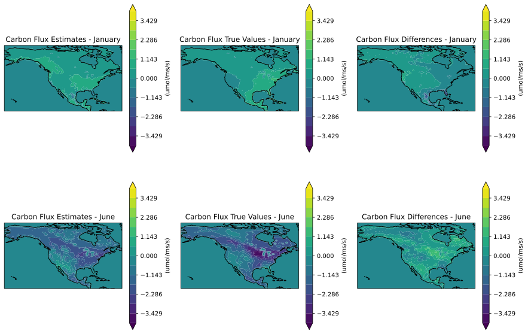
    


```python
plot_loss(large_model_history)
```


    
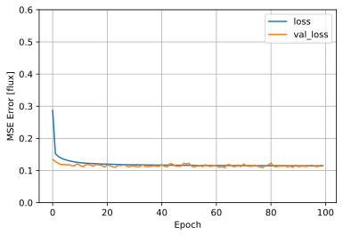
    


```python
fluxcom = data_dir + "fluxcom-2007-to-2012-NA-monthly.nc"
fluxcom = Dataset(fluxcom, 'r')  # open data file using netcdf reader


fluxcom_var = np.array(fluxcom.variables['FluxCom-ANN::NEE']) 
num_rows, num_cols = fluxcom_var.shape

fluxcom_var = fluxcom_var.reshape((num_rows*num_cols, 1),order='F') 
print(fluxcom_var.shape)
fluxcom_var=fluxcom_var[0: 31356]
print(fluxcom_var.shape)
print(y_test.shape)
```

    (188136, 1)
    (31356, 1)
    (31356, 1)


```python
print(fluxcom_var)
print(y_test)
```

    [[-0.55871633]
     [-0.86203155]
     [-1.18418195]
     ...
     [-0.11118916]
     [-0.08439272]
     [-0.24568092]]
    [[0.99319557]
     [0.98932448]
     [0.99699764]
     ...
     [0.52222681]
     [0.5263917 ]
     [0.53037997]]


```python
b = np.reshape(np.ravel(scaler_y_test.inverse_transform(y_test), order='F'), (2613,12,1,-1),order='F')
a = np.reshape(np.ravel(fluxcom_var, order='F'), (2613,12,1,-1),order='F')

X_test_mon = np.nanmean(a,axis=0)
X_tru_mon = np.mean(b,axis=0)
print(X_test_mon)


# average by month
X_test_mon = np.nanmean(X_test_mon,axis=1)
X_tru_mon = np.mean(X_tru_mon,axis=1)
print(X_test_mon)
# print(X_full_av_mon.shape)

# month variable
mon_array = np.arange(1, 13, dtype=float)

fig, (ax1, ax2)= plt.subplots(1, 2, figsize=(15,4), sharey=True)

ax1.plot(mon_array,X_test_mon[:,0],'-o',label="Fluxcom")
ax1.plot(mon_array,X_tru_mon[:,0],'-ok',label="Truth")
ax1.set_title(" North America Average Monthly")
ax1.set_xlabel("Month")
ax1.set_ylabel("umol/m2/s")


ax1.legend(loc="lower left")
ax1.grid()

year_diffs=X_tru_mon[:,0]-X_test_mon[:,0]

print(np.mean(year_diffs))
mean_diff_array=[]
for a in mon_array:
    mean_diff_array.append(np.mean(year_diffs))

ax2.plot(mon_array,X_tru_mon[:,0]-X_test_mon[:,0],'-or',label="Difference")
ax2.plot(mon_array, mean_diff_array,'-oy',label="Difference Mean")

ax2.set_title("Difference")
ax2.set_xlabel("Month")

ax2.legend(loc="lower left")
ax2.grid()
```

    [[[ 0.13092845]]
    
     [[ 0.09390846]]
    
     [[ 0.04950409]]
    
     [[-0.17327118]]
    
     [[-0.63484196]]
    
     [[-1.28776234]]
    
     [[-1.24568278]]
    
     [[-0.71430764]]
    
     [[-0.20482456]]
    
     [[ 0.08054943]]
    
     [[ 0.15040864]]
    
     [[ 0.1353508 ]]]
    [[ 0.13092845]
     [ 0.09390846]
     [ 0.04950409]
     [-0.17327118]
     [-0.63484196]
     [-1.28776234]
     [-1.24568278]
     [-0.71430764]
     [-0.20482456]
     [ 0.08054943]
     [ 0.15040864]
     [ 0.1353508 ]]
    0.2173773177753026


    
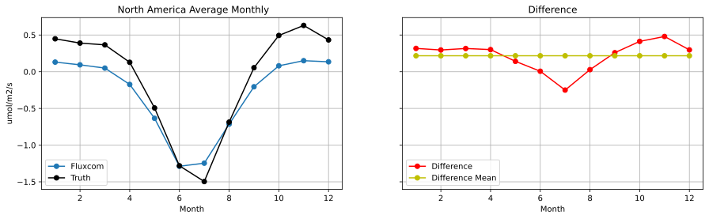
    


```python
filename_land = data_dir + "land_cover_NA_pct_2613.nc"
nc_land = Dataset(filename_land, 'r')  # open data file using netcdf reader
land_var= np.array(nc_land.variables["land_cover_pct"]) # create numpy array note shape of narr vars is [space dimension x time dimension]
land_var_full=np.tile(land_var,(1,9*12))
land_var_full = np.transpose(land_var_full)

print(land_var_full.shape)
```

    (282204, 18)


```python
from keras.layers import BatchNormalization
from keras.layers import Dropout
var_names = ['sp_hum','precip','soil_moisture','vpd','temp','precip_30d', 'R_sw', 'rel_hum']

# R_sw

final = []
# loop over variable names
for i in range(0, len(var_names)):
    final.append([])
    for number in range(2007, 2016):
        #print(number)
        filename_narr = data_dir + "predictors/narr-%d-NA-monthly.nc" % number
        nc_narr = Dataset(filename_narr, 'r')
        #print(i)
        narr_var = np.array(nc_narr.variables["{}".format(var_names[i])])
        num_rows, num_cols = narr_var.shape
        final[i].extend(narr_var.reshape((num_rows*num_cols, 1),order='F'))

# print(len(final))
# print(len(final[0]))
# print(len(final[0][0]))
X2 = np.array(final) # create numpy array from list

# print(X.shape)
X2 = np.transpose(np.squeeze(X2)) # transpose and remove singular dimension (squeeze)
print(X2.shape)


# double check shape/reshape order

# plot monthly average
print(flux_var.shape)


b = np.reshape(np.ravel(X2[:,3], order='F'), (2613,12,9,-1),order='F')

b = np.mean(b,axis=0)

print(b.shape)

b = np.mean(b,axis=1)

mon_array = np.arange(1, 13, dtype=float)

X_pars = np.concatenate((X2[:,3:6],month_vec),axis=1) # radiation, vpd, temp, 30d precip
X_narr = np.concatenate((X2,month_vec),axis=1) # All NARR
X_narr_sif = np.concatenate((X2,sif_var2A,month_vec),axis=1) # ALL NARR plus sif


X_full = np.concatenate((X2,sif_var2A,nirv_var, land_var_full),axis=1)
print(X_full.shape[1])


X_train = X_full[0:2613*8*12,:] # train on first 8 years
y_train = flux_var[0:2613*8*12] # train on first 8 years

X_test = X_full[2613*8*12:,:] # test on last year
y_test = flux_var[2613*8*12:] # test on last year

# transform for NN

# scaler_x = preprocessing.StandardScaler() # scaling zero mean unit variance
#scaler_y = preprocessing.StandardScaler() # scaling zero mean unit variance

# scale predictors between 0-1
scaler_x_train = preprocessing.MinMaxScaler(feature_range=(0, 1))
scaler_x_train.fit(X_train)
#scaler_y_train = preprocessing.MinMaxScaler(feature_range=(0, 1))

# try quantile transformation of flux data see: https://machinelearningmastery.com/quantile-transforms-for-machine-learning/
scaler_y_train = QuantileTransformer(random_state=0)
scaler_y_train.fit(y_train)

X_train = scaler_x_train.fit_transform(X_train) # transform training predictors data
y_train = scaler_y_train.fit_transform(y_train) # transform training flux data

scaler_x_test = preprocessing.MinMaxScaler(feature_range=(0, 1))
scaler_x_test.fit(X_test)

#scaler_y_test = preprocessing.MinMaxScaler(feature_range=(0, 1))
scaler_y_test = QuantileTransformer(random_state=0)
scaler_y_test.fit(y_test)


X_test = scaler_x_test.fit_transform(X_test) # transform test predictors data
y_test = scaler_y_test.fit_transform(y_test) # transform test flux data

print(X_train.shape)
print(y_train.shape)

print(X_test.shape)
print(y_test.shape)

large_model = Sequential()
large_model.add(Dense(50,input_dim=X_full.shape[1], activation='relu'))
large_model.add(BatchNormalization())
large_model.add(Dropout(.25))
large_model.add(Dense(100,input_dim=X_full.shape[1], activation='relu'))
large_model.add(BatchNormalization())
large_model.add(Dropout(.25))
large_model.add(Dense(100,input_dim=X_full.shape[1], activation='relu'))
large_model.add(BatchNormalization())
large_model.add(Dropout(.25))
large_model.add(Dense(100,input_dim=X_full.shape[1], activation='relu'))
large_model.add(BatchNormalization())
large_model.add(Dropout(.25))
large_model.add(Dense(50,input_dim=X_full.shape[1], activation='relu'))
large_model.add(BatchNormalization())
large_model.add(Dropout(.25))
large_model.add(Dense(50,input_dim=X_full.shape[1], activation='relu'))
large_model.add(BatchNormalization())
large_model.add(Dropout(.25))
large_model.add(Dense(1,input_dim=X_full.shape[1], activation='linear'))
x = tf.ones((1, X_full.shape[1]))
yt = large_model(x)
optimizer = keras.optimizers.Adam()
large_model.compile(loss='mae', optimizer=optimizer, metrics=['mae'])

large_model_history=large_model.fit(
    X_train, y_train,
    epochs=100,
    verbose=2,
    batch_size=256,
    shuffle = True,

   validation_data=(X_test, y_test))

test_results ={}
test_results['large_model'] = large_model.evaluate(
    X_test, y_test, verbose=0)
y_est = scaler_y_test.inverse_transform(large_model.predict(X_test))
a = plt.axes
#     axs[i-1].xlabel('True Values')
#     axs[i-1].ylabel('Predictions')
#     axs[i-1].ylim(-6, 6)
#     axs[i-1].xlim(-6, 6)
var1=scaler_y_test.inverse_transform(y_test)
var2=y_est
a = plt.axes
plt.scatter(scaler_y_test.inverse_transform(y_test),y_est )
plt.xlabel('True Values (umol/ms/s)')
plt.ylabel('Predictions (umol/ms/s)')
plt.ylim(-6, 6)
plt.xlim(-6, 6)
var1=scaler_y_test.inverse_transform(y_test)
var2=y_est
print(np.corrcoef(var1,var2,rowvar=False))

```

    (282204, 8)
    (282204, 1)
    (12, 9, 1)
    28
    (250848, 28)
    (250848, 1)
    (31356, 28)
    (31356, 1)
    Epoch 1/100
    980/980 - 5s - loss: 0.2705 - mae: 0.2705 - val_loss: 0.1252 - val_mae: 0.1252
    Epoch 2/100
    980/980 - 5s - loss: 0.1395 - mae: 0.1395 - val_loss: 0.1106 - val_mae: 0.1106
    Epoch 3/100
    980/980 - 5s - loss: 0.1278 - mae: 0.1278 - val_loss: 0.1054 - val_mae: 0.1054
    Epoch 4/100
    980/980 - 4s - loss: 0.1213 - mae: 0.1213 - val_loss: 0.1039 - val_mae: 0.1039
    Epoch 5/100
    980/980 - 4s - loss: 0.1170 - mae: 0.1170 - val_loss: 0.1019 - val_mae: 0.1019
    Epoch 6/100
    980/980 - 4s - loss: 0.1141 - mae: 0.1141 - val_loss: 0.0983 - val_mae: 0.0983
    Epoch 7/100
    980/980 - 4s - loss: 0.1114 - mae: 0.1114 - val_loss: 0.0986 - val_mae: 0.0986
    Epoch 8/100
    980/980 - 4s - loss: 0.1096 - mae: 0.1096 - val_loss: 0.0995 - val_mae: 0.0995
    Epoch 9/100
    980/980 - 4s - loss: 0.1084 - mae: 0.1084 - val_loss: 0.0952 - val_mae: 0.0952
    Epoch 10/100
    980/980 - 4s - loss: 0.1076 - mae: 0.1076 - val_loss: 0.0984 - val_mae: 0.0984
    Epoch 11/100
    980/980 - 4s - loss: 0.1065 - mae: 0.1065 - val_loss: 0.0992 - val_mae: 0.0992
    Epoch 12/100
    980/980 - 4s - loss: 0.1058 - mae: 0.1058 - val_loss: 0.0946 - val_mae: 0.0946
    Epoch 13/100
    980/980 - 4s - loss: 0.1052 - mae: 0.1052 - val_loss: 0.0944 - val_mae: 0.0944
    Epoch 14/100
    980/980 - 4s - loss: 0.1043 - mae: 0.1043 - val_loss: 0.0947 - val_mae: 0.0947
    Epoch 15/100
    980/980 - 4s - loss: 0.1036 - mae: 0.1036 - val_loss: 0.0926 - val_mae: 0.0926
    Epoch 16/100
    980/980 - 4s - loss: 0.1032 - mae: 0.1032 - val_loss: 0.0923 - val_mae: 0.0923
    Epoch 17/100
    980/980 - 4s - loss: 0.1030 - mae: 0.1030 - val_loss: 0.0945 - val_mae: 0.0945
    Epoch 18/100
    980/980 - 5s - loss: 0.1024 - mae: 0.1024 - val_loss: 0.0931 - val_mae: 0.0931
    Epoch 19/100
    980/980 - 4s - loss: 0.1024 - mae: 0.1024 - val_loss: 0.0921 - val_mae: 0.0921
    Epoch 20/100
    980/980 - 5s - loss: 0.1019 - mae: 0.1019 - val_loss: 0.0951 - val_mae: 0.0951
    Epoch 21/100
    980/980 - 5s - loss: 0.1017 - mae: 0.1017 - val_loss: 0.0907 - val_mae: 0.0907
    Epoch 22/100
    980/980 - 5s - loss: 0.1014 - mae: 0.1014 - val_loss: 0.0934 - val_mae: 0.0934
    Epoch 23/100
    980/980 - 4s - loss: 0.1013 - mae: 0.1013 - val_loss: 0.0964 - val_mae: 0.0964
    Epoch 24/100
    980/980 - 5s - loss: 0.1011 - mae: 0.1011 - val_loss: 0.0962 - val_mae: 0.0962
    Epoch 25/100
    980/980 - 4s - loss: 0.1008 - mae: 0.1008 - val_loss: 0.0908 - val_mae: 0.0908
    Epoch 26/100
    980/980 - 4s - loss: 0.1007 - mae: 0.1007 - val_loss: 0.0915 - val_mae: 0.0915
    Epoch 27/100
    980/980 - 5s - loss: 0.1005 - mae: 0.1005 - val_loss: 0.0957 - val_mae: 0.0957
    Epoch 28/100
    980/980 - 5s - loss: 0.1003 - mae: 0.1003 - val_loss: 0.0943 - val_mae: 0.0943
    Epoch 29/100
    980/980 - 5s - loss: 0.1000 - mae: 0.1000 - val_loss: 0.0931 - val_mae: 0.0931
    Epoch 30/100
    980/980 - 5s - loss: 0.1001 - mae: 0.1001 - val_loss: 0.0919 - val_mae: 0.0919
    Epoch 31/100
    980/980 - 4s - loss: 0.0998 - mae: 0.0998 - val_loss: 0.0914 - val_mae: 0.0914
    Epoch 32/100
    980/980 - 4s - loss: 0.0997 - mae: 0.0997 - val_loss: 0.0917 - val_mae: 0.0917
    Epoch 33/100
    980/980 - 4s - loss: 0.0995 - mae: 0.0995 - val_loss: 0.0900 - val_mae: 0.0900
    Epoch 34/100
    980/980 - 4s - loss: 0.0994 - mae: 0.0994 - val_loss: 0.0934 - val_mae: 0.0934
    Epoch 35/100
    980/980 - 4s - loss: 0.0995 - mae: 0.0995 - val_loss: 0.0936 - val_mae: 0.0936
    Epoch 36/100
    980/980 - 4s - loss: 0.0993 - mae: 0.0993 - val_loss: 0.1001 - val_mae: 0.1001
    Epoch 37/100
    980/980 - 4s - loss: 0.0991 - mae: 0.0991 - val_loss: 0.0932 - val_mae: 0.0932
    Epoch 38/100
    980/980 - 4s - loss: 0.0987 - mae: 0.0987 - val_loss: 0.0896 - val_mae: 0.0896
    Epoch 39/100
    980/980 - 4s - loss: 0.0990 - mae: 0.0990 - val_loss: 0.0924 - val_mae: 0.0924
    Epoch 40/100
    980/980 - 4s - loss: 0.0988 - mae: 0.0988 - val_loss: 0.0914 - val_mae: 0.0914
    Epoch 41/100
    980/980 - 4s - loss: 0.0988 - mae: 0.0988 - val_loss: 0.0904 - val_mae: 0.0904
    Epoch 42/100
    980/980 - 4s - loss: 0.0988 - mae: 0.0988 - val_loss: 0.0919 - val_mae: 0.0919
    Epoch 43/100
    980/980 - 4s - loss: 0.0985 - mae: 0.0985 - val_loss: 0.0932 - val_mae: 0.0932
    Epoch 44/100
    980/980 - 4s - loss: 0.0986 - mae: 0.0986 - val_loss: 0.0914 - val_mae: 0.0914
    Epoch 45/100
    980/980 - 4s - loss: 0.0985 - mae: 0.0985 - val_loss: 0.0972 - val_mae: 0.0972
    Epoch 46/100
    980/980 - 4s - loss: 0.0983 - mae: 0.0983 - val_loss: 0.0918 - val_mae: 0.0918
    Epoch 47/100
    980/980 - 5s - loss: 0.0985 - mae: 0.0985 - val_loss: 0.0933 - val_mae: 0.0933
    Epoch 48/100
    980/980 - 5s - loss: 0.0982 - mae: 0.0982 - val_loss: 0.0926 - val_mae: 0.0926
    Epoch 49/100
    980/980 - 4s - loss: 0.0982 - mae: 0.0982 - val_loss: 0.0935 - val_mae: 0.0935
    Epoch 50/100
    980/980 - 4s - loss: 0.0980 - mae: 0.0980 - val_loss: 0.0949 - val_mae: 0.0949
    Epoch 51/100
    980/980 - 4s - loss: 0.0981 - mae: 0.0981 - val_loss: 0.0919 - val_mae: 0.0919
    Epoch 52/100
    980/980 - 4s - loss: 0.0979 - mae: 0.0979 - val_loss: 0.0906 - val_mae: 0.0906
    Epoch 53/100
    980/980 - 4s - loss: 0.0981 - mae: 0.0981 - val_loss: 0.0929 - val_mae: 0.0929
    Epoch 54/100
    980/980 - 5s - loss: 0.0978 - mae: 0.0978 - val_loss: 0.0933 - val_mae: 0.0933
    Epoch 55/100
    980/980 - 5s - loss: 0.0981 - mae: 0.0981 - val_loss: 0.0945 - val_mae: 0.0945
    Epoch 56/100
    980/980 - 5s - loss: 0.0977 - mae: 0.0977 - val_loss: 0.0919 - val_mae: 0.0919
    Epoch 57/100
    980/980 - 5s - loss: 0.0978 - mae: 0.0978 - val_loss: 0.0898 - val_mae: 0.0898
    Epoch 58/100
    980/980 - 5s - loss: 0.0977 - mae: 0.0977 - val_loss: 0.0942 - val_mae: 0.0942
    Epoch 59/100
    980/980 - 5s - loss: 0.0977 - mae: 0.0977 - val_loss: 0.0911 - val_mae: 0.0911
    Epoch 60/100
    980/980 - 5s - loss: 0.0975 - mae: 0.0975 - val_loss: 0.0898 - val_mae: 0.0898
    Epoch 61/100
    980/980 - 5s - loss: 0.0975 - mae: 0.0975 - val_loss: 0.0909 - val_mae: 0.0909
    Epoch 62/100
    980/980 - 4s - loss: 0.0974 - mae: 0.0974 - val_loss: 0.0924 - val_mae: 0.0924
    Epoch 63/100
    980/980 - 4s - loss: 0.0974 - mae: 0.0974 - val_loss: 0.0929 - val_mae: 0.0929
    Epoch 64/100
    980/980 - 4s - loss: 0.0973 - mae: 0.0973 - val_loss: 0.0910 - val_mae: 0.0910
    Epoch 65/100
    980/980 - 4s - loss: 0.0975 - mae: 0.0975 - val_loss: 0.0924 - val_mae: 0.0924
    Epoch 66/100
    980/980 - 4s - loss: 0.0977 - mae: 0.0977 - val_loss: 0.0902 - val_mae: 0.0902
    Epoch 67/100
    980/980 - 4s - loss: 0.0969 - mae: 0.0969 - val_loss: 0.0901 - val_mae: 0.0901
    Epoch 68/100
    980/980 - 4s - loss: 0.0972 - mae: 0.0972 - val_loss: 0.0891 - val_mae: 0.0891
    Epoch 69/100
    980/980 - 4s - loss: 0.0972 - mae: 0.0972 - val_loss: 0.0894 - val_mae: 0.0894
    Epoch 70/100
    980/980 - 5s - loss: 0.0973 - mae: 0.0973 - val_loss: 0.0926 - val_mae: 0.0926
    Epoch 71/100
    980/980 - 4s - loss: 0.0973 - mae: 0.0973 - val_loss: 0.0925 - val_mae: 0.0925
    Epoch 72/100
    980/980 - 4s - loss: 0.0969 - mae: 0.0969 - val_loss: 0.0902 - val_mae: 0.0902
    Epoch 73/100
    980/980 - 4s - loss: 0.0971 - mae: 0.0971 - val_loss: 0.0922 - val_mae: 0.0922
    Epoch 74/100
    980/980 - 4s - loss: 0.0970 - mae: 0.0970 - val_loss: 0.0898 - val_mae: 0.0898
    Epoch 75/100
    980/980 - 4s - loss: 0.0971 - mae: 0.0971 - val_loss: 0.0927 - val_mae: 0.0927
    Epoch 76/100
    980/980 - 4s - loss: 0.0971 - mae: 0.0971 - val_loss: 0.0915 - val_mae: 0.0915
    Epoch 77/100
    980/980 - 4s - loss: 0.0968 - mae: 0.0968 - val_loss: 0.0925 - val_mae: 0.0925
    Epoch 78/100
    980/980 - 5s - loss: 0.0969 - mae: 0.0969 - val_loss: 0.0918 - val_mae: 0.0918
    Epoch 79/100
    980/980 - 5s - loss: 0.0969 - mae: 0.0969 - val_loss: 0.0933 - val_mae: 0.0933
    Epoch 80/100
    980/980 - 4s - loss: 0.0967 - mae: 0.0967 - val_loss: 0.0949 - val_mae: 0.0949
    Epoch 81/100
    980/980 - 4s - loss: 0.0966 - mae: 0.0966 - val_loss: 0.0897 - val_mae: 0.0897
    Epoch 82/100
    980/980 - 4s - loss: 0.0967 - mae: 0.0967 - val_loss: 0.0912 - val_mae: 0.0912
    Epoch 83/100
    980/980 - 4s - loss: 0.0966 - mae: 0.0966 - val_loss: 0.0905 - val_mae: 0.0905
    Epoch 84/100
    980/980 - 4s - loss: 0.0968 - mae: 0.0968 - val_loss: 0.0908 - val_mae: 0.0908
    Epoch 85/100
    980/980 - 5s - loss: 0.0965 - mae: 0.0965 - val_loss: 0.0906 - val_mae: 0.0906
    Epoch 86/100
    980/980 - 4s - loss: 0.0965 - mae: 0.0965 - val_loss: 0.0921 - val_mae: 0.0921
    Epoch 87/100
    980/980 - 4s - loss: 0.0968 - mae: 0.0968 - val_loss: 0.0929 - val_mae: 0.0929
    Epoch 88/100
    980/980 - 5s - loss: 0.0967 - mae: 0.0967 - val_loss: 0.0901 - val_mae: 0.0901
    Epoch 89/100
    980/980 - 4s - loss: 0.0966 - mae: 0.0966 - val_loss: 0.0956 - val_mae: 0.0956
    Epoch 90/100
    980/980 - 5s - loss: 0.0966 - mae: 0.0966 - val_loss: 0.0909 - val_mae: 0.0909
    Epoch 91/100
    980/980 - 4s - loss: 0.0966 - mae: 0.0966 - val_loss: 0.0911 - val_mae: 0.0911
    Epoch 92/100
    980/980 - 5s - loss: 0.0963 - mae: 0.0963 - val_loss: 0.0911 - val_mae: 0.0911
    Epoch 93/100
    980/980 - 4s - loss: 0.0965 - mae: 0.0965 - val_loss: 0.0901 - val_mae: 0.0901
    Epoch 94/100
    980/980 - 4s - loss: 0.0965 - mae: 0.0965 - val_loss: 0.0916 - val_mae: 0.0916
    Epoch 95/100
    980/980 - 4s - loss: 0.0965 - mae: 0.0965 - val_loss: 0.0919 - val_mae: 0.0919
    Epoch 96/100
    980/980 - 4s - loss: 0.0962 - mae: 0.0962 - val_loss: 0.0914 - val_mae: 0.0914
    Epoch 97/100
    980/980 - 4s - loss: 0.0965 - mae: 0.0965 - val_loss: 0.0916 - val_mae: 0.0916
    Epoch 98/100
    980/980 - 4s - loss: 0.0963 - mae: 0.0963 - val_loss: 0.0930 - val_mae: 0.0930
    Epoch 99/100
    980/980 - 4s - loss: 0.0964 - mae: 0.0964 - val_loss: 0.0901 - val_mae: 0.0901
    Epoch 100/100
    980/980 - 4s - loss: 0.0962 - mae: 0.0962 - val_loss: 0.0905 - val_mae: 0.0905
    [[1.        0.9037458]
     [0.9037458 1.       ]]


    

    


```python
b = np.reshape(np.ravel(scaler_y_test.inverse_transform(y_test), order='F'), (2613,12,1,-1),order='F')
a = np.reshape(np.ravel(y_est, order='F'), (2613,12,1,-1),order='F')

X_test_mon = np.mean(a,axis=0)
X_tru_mon = np.mean(b,axis=0)

print(X_test_mon.shape)
# average by month
X_test_mon = np.mean(X_test_mon,axis=1)
X_tru_mon = np.mean(X_tru_mon,axis=1)

# print(X_full_av_mon.shape)

# month variable
mon_array = np.arange(1, 13, dtype=float)

fig, (ax1, ax2)= plt.subplots(1, 2, figsize=(15,4), sharey=True)

ax1.plot(mon_array,X_test_mon[:,0],'-o',label="Estimates")
ax1.plot(mon_array,X_tru_mon[:,0],'-ok',label="Truth")
ax1.set_title(" North America Average Monthly")
ax1.set_xlabel("Month")
ax1.set_ylabel("Flux (umol/m2/s)")


ax1.legend(loc="lower left")
ax1.grid()

year_diffs=X_tru_mon[:,0]-X_test_mon[:,0]

print(np.mean(year_diffs))
mean_diff_array=[]
for a in mon_array:
    mean_diff_array.append(np.mean(year_diffs))

ax2.plot(mon_array,X_tru_mon[:,0]-X_test_mon[:,0],'-or',label="Difference")
ax2.plot(mon_array, mean_diff_array,'-oy',label="Difference Mean")

ax2.set_title("Difference")
ax2.set_xlabel("Month")

ax2.legend(loc="lower left")
ax2.grid()
```

    (12, 1, 1)
    0.02096487682617273


    
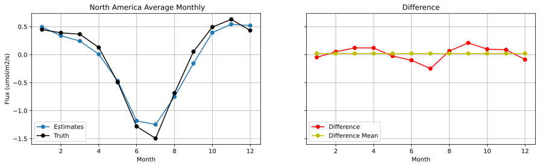
    


```python
b = np.reshape(np.ravel(scaler_y_test.inverse_transform(y_test), order='F'), (2613,12,1,-1),order='F')
a = np.reshape(np.ravel(fluxcom_var, order='F'), (2613,12,1,-1),order='F')
c = np.reshape(np.ravel(y_est, order='F'), (2613,12,1,-1),order='F')

est_mon = np.mean(c,axis=0)
X_test_mon = np.nanmean(a,axis=0)
X_tru_mon = np.mean(b,axis=0)
print(X_test_mon)


# average by month
X_test_mon = np.nanmean(X_test_mon,axis=1)
X_tru_mon = np.mean(X_tru_mon,axis=1)

est_mon = np.nanmean(est_mon,axis=1)

print(X_test_mon)
# print(X_full_av_mon.shape)

# month variable
mon_array = np.arange(1, 13, dtype=float)

fig, (ax1, ax2)= plt.subplots(1, 2, figsize=(15,4), sharey=True)

ax1.plot(mon_array,X_test_mon[:,0],'-o',label="Fluxcom")
ax1.plot(mon_array,X_tru_mon[:,0],'-ok',label="Truth")
ax1.plot(mon_array,est_mon[:,0],'-or',label="Estimates")
ax1.set_title(" North America Average Monthly")
ax1.set_xlabel("Month")
ax1.set_ylabel("Flux (umol/m2/s)")

ax1.legend(loc="lower left")
ax1.grid()

year_diffs=X_tru_mon[:,0]-X_test_mon[:,0]

print(np.mean(year_diffs))
mean_diff_array=[]
for a in mon_array:
    mean_diff_array.append(np.mean(year_diffs))

ax2.plot(mon_array,X_tru_mon[:,0]-X_test_mon[:,0],'-or',label="Difference")
ax2.plot(mon_array, mean_diff_array,'-oy',label="Difference Mean")

ax2.set_title("Difference")
ax2.set_xlabel("Month")

ax2.legend(loc="lower left")
ax2.grid()
```

    [[[ 0.13092845]]
    
     [[ 0.09390846]]
    
     [[ 0.04950409]]
    
     [[-0.17327118]]
    
     [[-0.63484196]]
    
     [[-1.28776234]]
    
     [[-1.24568278]]
    
     [[-0.71430764]]
    
     [[-0.20482456]]
    
     [[ 0.08054943]]
    
     [[ 0.15040864]]
    
     [[ 0.1353508 ]]]
    [[ 0.13092845]
     [ 0.09390846]
     [ 0.04950409]
     [-0.17327118]
     [-0.63484196]
     [-1.28776234]
     [-1.24568278]
     [-0.71430764]
     [-0.20482456]
     [ 0.08054943]
     [ 0.15040864]
     [ 0.1353508 ]]
    0.2173773177753026


    
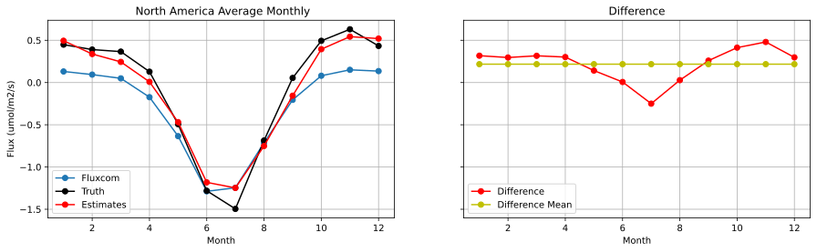
    


```python
fig, ((ax1, ax2, ax3), 
      (ax4, ax5, ax6)) = plt.subplots( 2,3, 
            subplot_kw={'projection': ccrs.PlateCarree()}, figsize=(15,10))

a = np.reshape(np.ravel(y_est, order='F'), (2613,12,1,-1),order='F') 
realvals = np.reshape(np.ravel(scaler_y_test.inverse_transform(y_test), order='F'), (2613,12,1,-1),order='F') 
levels = np.linspace(-4, 4, 15)


xi, yi, zi_flux = data2grid(lats,lons,a[:,1])
a1=ax1.contourf(xi, yi, zi_flux, 60,levels=levels,
             transform=ccrs.PlateCarree(),extend='both')

cbr=fig.colorbar(a1,ax=ax1)
cbr.set_label('(umol/ms/s)')
ax1.coastlines()
ax1.set(title=('Carbon Flux Estimates - January'))
        
        
xi, yi, zi_flux = data2grid(lats,lons,realvals[:,1])
a2=ax2.contourf(xi, yi, zi_flux, 60,levels=levels,
             transform=ccrs.PlateCarree(),extend='both')

cbr=fig.colorbar(a2,ax=ax2)
cbr.set_label('(umol/ms/s)')
ax2.coastlines()
ax2.set(title=('Carbon Flux True Values - January'))
        
diffs = a-realvals

xi, yi, zi_flux = data2grid(lats,lons,diffs[:, 1]) 
a3=ax3.contourf(xi, yi, zi_flux, 60,levels=levels,
    transform=ccrs.PlateCarree(),extend='both')


cbr=fig.colorbar(a3,ax=ax3)
cbr.set_label('(umol/ms/s)')
ax3.coastlines()
ax3.set(title=('Carbon Flux Differences - January'))


xi, yi, zi_flux = data2grid(lats,lons,a[:,6])
a4=ax4.contourf(xi, yi, zi_flux, 60,levels=levels,
             transform=ccrs.PlateCarree(),extend='both')


cbr=fig.colorbar(a4,ax=ax4)
cbr.set_label('(umol/ms/s)')
ax4.coastlines()
ax4.set(title=('Carbon Flux Estimates - June'))
        
        
xi, yi, zi_flux = data2grid(lats,lons,realvals[:,6])
a5=ax5.contourf(xi, yi, zi_flux, 60,levels=levels,
             transform=ccrs.PlateCarree(),extend='both')


cbr=fig.colorbar(a5,ax=ax5)
cbr.set_label('(umol/ms/s)')
ax5.coastlines()
ax5.set(title=('Carbon Flux True Values - June'))
        
diffs = a-realvals

xi, yi, zi_flux = data2grid(lats,lons,diffs[:, 6]) 
a6=ax6.contourf(xi, yi, zi_flux, 60,levels=levels,
    transform=ccrs.PlateCarree(),extend='both')


cbr=fig.colorbar(a6,ax=ax6)
cbr.set_label('(umol/ms/s)')
ax6.coastlines()
ax6.set(title=('Carbon Flux Differences - June'))
```


    [Text(0.5, 1.0, 'Carbon Flux Differences - June')]


    
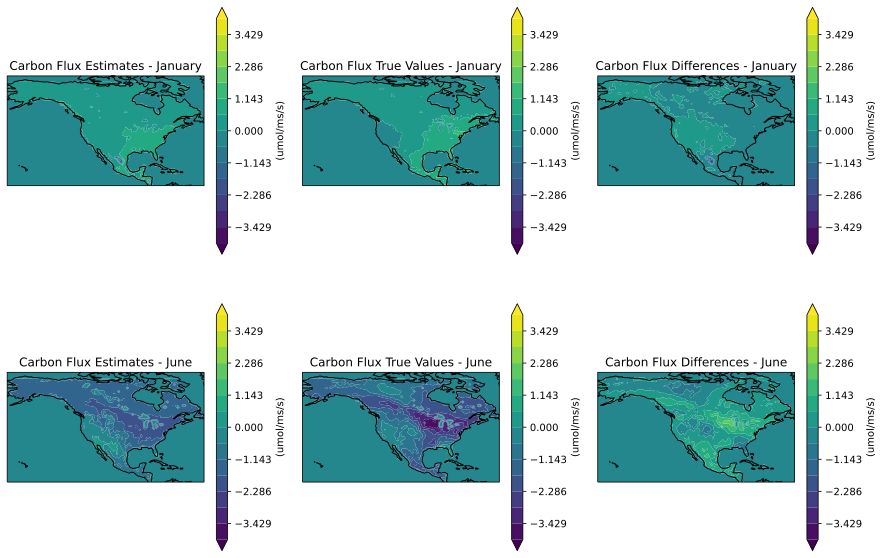
    


```python
flux = nc_inv.variables['monthly_flux'][0, :] # note shape of flux is [space dimension x time dimension]

# save lat lon from **MODIS** variable ****<<<<<IMPORTANT>>>>>******
lats = nc_modis.variables['lat'][:]
lons = nc_modis.variables['lon'][:]

xi, yi, zi_flux = data2grid(lats,lons,flux) # regrid for plotting

for i in range(len(zi_flux)):
    zi_flux[i]=np.mean(zi_flux[i])
# projection axis
ax = plt.axes(projection=ccrs.PlateCarree())


# plot contour of variable using gridded  lat, lon, and variable
plt.contourf(xi, yi, zi_flux, 60,
             transform=ccrs.PlateCarree())
# add coasts
ax.coastlines()


plt.colorbar()
plt.show()

```


    
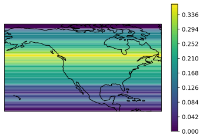
    


```python

```
